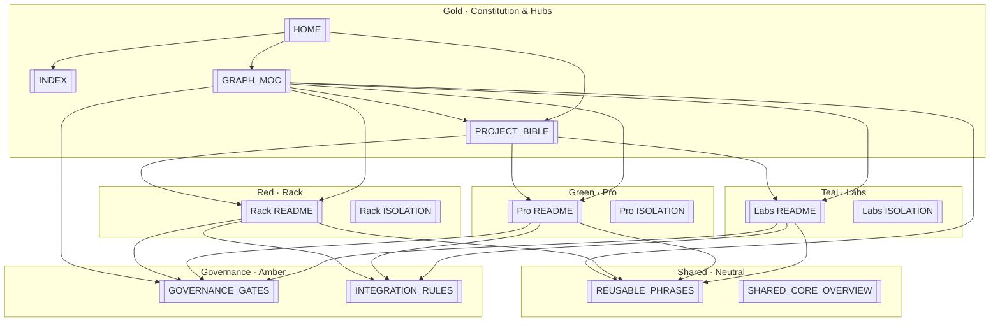

# Graph MOC · مركز الرسم المعرفي

![[03_SHARED_CORE/branding/benbenhub-logo.png|100]]

**EN:** **Central visual hub** for Obsidian Graph View — dense wikilinks tie constitution, three platform islands, shared core, and governance into one navigable mesh. Open this note first, then global or local graph.

**AR:** **المركز البصري** لعرض الرسم — روابط كثيفة تربط الدستور والمنصات الثلاث والنواة والحوكمة. افتح هذه الملاحظة أولاً، ثم الرسم العام أو المحلي.

| | EN | AR | Open |
|--|----|----|------|
| **Vault** | Architecture SSOT | خزنة المعمارية | [[README]] · [[INDEX]] |
| **Daily** | Command center | لوحة اليوم | [[00_ROOT_DASHBOARD/HOME]] |
| **Law** | Project Bible | الدستور | [[01_CONSTITUTION/PROJECT_BIBLE]] |
| **Platforms** | Island index | فهرس الجزر | [[02_PLATFORMS/PLATFORMS_INDEX]] |

#graph-hub #graph-moc #platforms #governance #constitution

---

## Quick start · بداية سريعة (Graph View)

| Step | EN | AR | Action |
|:----:|----|----|--------|
| 1 | Open this hub | افتح المركز | You are here · [[02_PLATFORMS/GRAPH_MOC]] |
| 2 | Reload colors | أعد تحميل الألوان | **Ctrl+P** → `Reload app without saving` |
| 3 | Global graph | الرسم العام | **Ctrl+G** |
| 4 | Local island | جزيرة محلية | Open [[02_PLATFORMS/Rack/README]] (or Pro/Labs) → **Ctrl+P** → `Graph view: Open local graph` |
| 5 | Groups ON | فعّل المجموعات | Sidebar → **Groups** → top 4 rules enabled (see below) |

**Config file (committed):** `.obsidian/graph.json` · **CSS (optional):** Settings → Appearance → **benbenhub-visual-identity**

---

## Visual identity · نظام الألوان (Graph View)

**EN:** Colors come from **path-first** rules in `graph.json`, then `color:` frontmatter, then tags `#graph-color-*`. Platform READMEs must **not** use `#graph-hub` (forces gold over red/green/teal).

**AR:** الألوان من قواعد **المسار أولاً** في `graph.json`، ثم `color:`، ثم الوسوم. خرائط المنصات **بدون** `#graph-hub`.

### Color & logo matrix | جدول الألوان والشعارات

| Entity | EN | AR | `color` | Hex | Graph filter | Logo |
|--------|----|----|---------|-----|--------------|------|
| **BENBENHUB** | Hidden parent · constitution | أب مخفي · دستور | `gold` | `#FFD700` | `path:01_CONSTITUTION` · `[color:gold]` | ![[03_SHARED_CORE/branding/benbenhub-logo.png\|56]] |
| **Circuit Rack** | Commerce island | جزيرة التجارة | `red` | `#E53935` | `path:02_PLATFORMS/rack` · `[color:red]` | ![[03_SHARED_CORE/branding/circuit-rack-logo.png\|56]] |
| **Circuit Pro** | Identity & geo | هوية وجغرافيا | `green` | `#2E7D32` | `path:02_PLATFORMS/pro` · `[color:green]` | ![[03_SHARED_CORE/branding/circuit-pro-logo.png\|56]] |
| **Circuit Labs** | Knowledge island | جزيرة المعرفة | `teal` | `#009688` | `path:02_PLATFORMS/labs` · `[color:teal]` | ![[03_SHARED_CORE/branding/circuit-labs-logo.png\|56]] |
| **Shared core** | Thin services | نواة رفيعة | — | `#9392AD` | `path:03_SHARED_CORE` | [[03_SHARED_CORE/branding/README]] |
| **Governance** | Gates & law | بوابات وقانون | — | `#B7791F` | `path:04_GOVERNANCE` | — |

**Branding SSOT:** [[01_CONSTITUTION/PROJECT_BIBLE#Branding & Visual Identity | الهوية البصرية]]

### Group priority (top wins) | أولوية المجموعات

1. `path:02_PLATFORMS/rack` → red  
2. `path:02_PLATFORMS/labs` → teal  
3. `path:02_PLATFORMS/pro` → green  
4. `path:01_CONSTITUTION` → gold  
5. Hub paths (`INDEX`, `HOME`, `GRAPH_MOC`, `PLATFORMS_INDEX`, `README`, `00_ROOT_DASHBOARD`) → gold  
6. `[color:*]` and `tag:#graph-color-*` fallbacks  
7. `tag:#graph-hub` → gold (this file only — not platform MOCs)  
8. `path:03_SHARED_CORE` · `path:04_GOVERNANCE` → neutral accents  

---

## Ecosystem mesh · شبكة المنظومة



**ASCII (wikilink targets):**

```
[[INDEX]] · [[HOME]] · [[GRAPH_MOC]]
         \         |         /
          [[01_CONSTITUTION/PROJECT_BIBLE]]
            /      |      \
   [[Rack/README]] [[Pro/README]] [[Labs/README]]
        |    \      |      /    |
        |     [[03_SHARED_CORE/REUSABLE_PHRASES]]
        |            |
   [[04_GOVERNANCE/GOVERNANCE_GATES]] · [[04_GOVERNANCE/INTEGRATION_RULES]]
```

---

## Hub index · فهرس المركز (wikilinks)

### Constitution & entry | الدستور والمدخل

| Node | Link |
|------|------|
| Master index | [[INDEX]] |
| Vault README | [[README]] |
| Project Bible | [[01_CONSTITUTION/PROJECT_BIBLE]] |
| Constitution folder | [[01_CONSTITUTION/README]] |
| Notion archive (reference) | [[01_CONSTITUTION/NOTION_SOURCE_ARCHIVE]] |
| Branding & logos | [[01_CONSTITUTION/PROJECT_BIBLE#Branding & Visual Identity]] |
| Vision & philosophy | [[01_CONSTITUTION/PROJECT_BIBLE#Vision & Philosophy]] |
| Governance gates (Bible) | [[01_CONSTITUTION/PROJECT_BIBLE#Key Governance Gates]] |
| Platforms overview (Bible) | [[01_CONSTITUTION/PROJECT_BIBLE#Platforms Overview]] |

### Platform islands | جزر المنصات

| Platform | MOC | Overview | Features | Isolation | Bible section |
|----------|-----|----------|----------|-----------|---------------|
| **Rack** `red` | [[02_PLATFORMS/Rack/README]] | [[02_PLATFORMS/Rack/OVERVIEW]] | [[02_PLATFORMS/Rack/FEATURES_MODULES]] | [[02_PLATFORMS/Rack/ISOLATION]] | [[01_CONSTITUTION/PROJECT_BIBLE#Circuit Rack \| سيركيت راك]] |
| **Pro** `green` | [[02_PLATFORMS/Pro/README]] | [[02_PLATFORMS/Pro/OVERVIEW]] | [[02_PLATFORMS/Pro/FEATURES_MODULES]] | [[02_PLATFORMS/Pro/ISOLATION]] | [[01_CONSTITUTION/PROJECT_BIBLE#Circuit Pro \| سيركيت برو]] |
| **Labs** `teal` | [[02_PLATFORMS/Labs/README]] | [[02_PLATFORMS/Labs/OVERVIEW]] | [[02_PLATFORMS/Labs/FEATURES_MODULES]] | [[02_PLATFORMS/Labs/ISOLATION]] | [[01_CONSTITUTION/PROJECT_BIBLE#Circuit Labs \| سيركيت لابز]] |

**Index:** [[02_PLATFORMS/PLATFORMS_INDEX]] · **Module registry:** [[02_PLATFORMS/FEATURES_MODULES_DATABASE]]

### Vision & agreements (SSOT anchors) | الرؤية والاتفاقات

| Platform | Vision SSOT | Agreements SSOT |
|----------|-------------|-----------------|
| Rack | [[01_CONSTITUTION/PROJECT_BIBLE#Rack Vision & Mission SSOT]] | [[01_CONSTITUTION/PROJECT_BIBLE#Rack Key Agreements SSOT]] |
| Pro | [[01_CONSTITUTION/PROJECT_BIBLE#Pro Vision & Mission SSOT]] | [[01_CONSTITUTION/PROJECT_BIBLE#Pro Key Agreements SSOT]] |
| Labs | [[01_CONSTITUTION/PROJECT_BIBLE#Labs Vision & Mission SSOT]] | [[01_CONSTITUTION/PROJECT_BIBLE#Labs Key Agreements SSOT]] |

### Shared core | النواة المشتركة

| Doc | Link |
|-----|------|
| Overview | [[03_SHARED_CORE/SHARED_CORE_OVERVIEW]] |
| Phrase bank | [[03_SHARED_CORE/REUSABLE_PHRASES]] |
| Identity | [[03_SHARED_CORE/IDENTITY_SYSTEM]] |
| Wallet | [[03_SHARED_CORE/CIRCUIT_WALLET]] |
| Theme & i18n | [[03_SHARED_CORE/THEME_AND_I18N]] |
| Integration | [[03_SHARED_CORE/PLATFORM_INTEGRATION]] |
| Technical architecture | [[03_SHARED_CORE/TECHNICAL_ARCHITECTURE]] |
| Brand assets | [[03_SHARED_CORE/branding/README]] |

### Governance | الحوكمة

| Doc | Link |
|-----|------|
| Three gates | [[04_GOVERNANCE/GOVERNANCE_GATES]] |
| Integration rules | [[04_GOVERNANCE/INTEGRATION_RULES]] |
| Decisions | [[04_GOVERNANCE/decisions/README]] |
| Integration (Bible) | [[01_CONSTITUTION/PROJECT_BIBLE#Platform Relationships & Backend Integration Rules]] |

### Operations | التشغيل

| Doc | Link |
|-----|------|
| Home dashboard | [[00_ROOT_DASHBOARD/HOME]] |
| Daily index | [[00_ROOT_DASHBOARD/DAILY/DAILY_INDEX]] |
| Platform map | [[00_ROOT_DASHBOARD/PLATFORM_MAP]] |
| Quick links | [[00_ROOT_DASHBOARD/QUICK_LINKS]] |

---

## Phrase bank cross-links · بنك الجمل

| Platform | Section | Tag hint |
|----------|---------|----------|
| Shared / general | [[03_SHARED_CORE/REUSABLE_PHRASES#General / Shared]] | `G-*` |
| Rack | [[03_SHARED_CORE/REUSABLE_PHRASES#Circuit Rack]] | `R-*` · `#rack` |
| Pro | [[03_SHARED_CORE/REUSABLE_PHRASES#Circuit Pro]] | `P-*` · `#pro` |
| Labs | [[03_SHARED_CORE/REUSABLE_PHRASES#Circuit Labs]] | `L-*` · `#labs` |
| Isolation & governance | [[03_SHARED_CORE/REUSABLE_PHRASES#Isolation & Governance]] | `I-*` · `GV-*` |

---

## Graph filters · مرشحات الرسم (copy-paste)

Paste into the Graph **search** box (global **Ctrl+G** or local graph).

### Single island | جزيرة واحدة

| Goal | EN | Filter |
|------|----|--------|
| Rack cluster | Red commerce island | `path:02_PLATFORMS/rack` |
| Pro cluster | Green identity island | `path:02_PLATFORMS/pro` |
| Labs cluster | Teal knowledge island | `path:02_PLATFORMS/labs` |
| Constitution | Gold law | `path:01_CONSTITUTION` |
| Shared core | Neutral services | `path:03_SHARED_CORE` |
| Governance | Gates & ADRs | `path:04_GOVERNANCE` |
| Dashboard | Daily ops | `path:00_ROOT_DASHBOARD` |

### Combined views | عروض مركبة

| Goal | EN | Filter |
|------|----|--------|
| All platforms | Three islands | `path:02_PLATFORMS/rack OR path:02_PLATFORMS/pro OR path:02_PLATFORMS/labs` |
| Bible + platforms | Law + MOCs | `path:01_CONSTITUTION OR path:02_PLATFORMS` |
| Hub only | Indexes & this file | `path:INDEX OR path:02_PLATFORMS/GRAPH_MOC OR path:02_PLATFORMS/PLATFORMS_INDEX` |
| Hide shared core | Less noise | `-path:03_SHARED_CORE` |
| Hide archives | Focus active SSOT | `-path:05_ARCHIVES` |
| By frontmatter | Property match | `[color:red]` · `[color:green]` · `[color:teal]` · `[color:gold]` |
| By tag | Platform tag | `tag:#graph-color-rack` · `tag:#graph-color-pro` · `tag:#graph-color-labs` |

### Local graph · الرسم المحلي

| Start from | EN | Steps |
|------------|----|-------|
| Rack island | Neighbors of commerce MOC | Open [[02_PLATFORMS/Rack/README]] → **Ctrl+P** → `Graph view: Open local graph` |
| Pro island | Neighbors of identity MOC | Open [[02_PLATFORMS/Pro/README]] → local graph |
| Labs island | Neighbors of knowledge MOC | Open [[02_PLATFORMS/Labs/README]] → local graph |
| This hub | Constitution + all spokes | Open [[02_PLATFORMS/GRAPH_MOC]] → local graph (dense star) |
| Bible | Full law neighborhood | Open [[01_CONSTITUTION/PROJECT_BIBLE]] → local graph |

**EN:** Local graph shows **1-hop** (and depth setting) wikilinks — best for understanding one platform without vault noise.

**AR:** الرسم المحلي يعرض جيران الروابط — الأفضل لفهم منصة واحدة.

---

## Groups & colors · المجموعات والألوان

### Activation checklist | قائمة التفعيل

1. Vault root = **`E:\BENBENHUB-CORE`** (folder containing [[INDEX]]).
2. **Reload app without saving** after any git pull that touches `graph.json`.
3. Graph sidebar → **Groups** expanded (`"close": false` in config).
4. Enable (colored dot) at minimum: **rack · labs · pro · constitution**.
5. If all nodes gray: `git checkout -- .obsidian/graph.json` → reload → **do not save** from Graph settings UI.

### Display tuning | ضبط العرض

| Setting | Recommended | Why |
|---------|-------------|-----|
| **Show tags** | ON | See `#graph-color-*` on platform files |
| **Show attachments** | OFF | Reduces logo-file node clutter |
| **Arrows** | ON | Shows link direction |
| **Node size** | ~1.15× | Hub files slightly larger (in `graph.json`) |
| **Forces** | Default / light tweak | Readable clusters without overlap |

---

## Peer mesh (API-only) · شبكة الأقران

**EN:** Platforms link to each other in docs for **backend contracts only** — never consumer UI coupling.

| From → To | EN | Link |
|-----------|----|------|
| Rack ↔ Pro | Trust snapshots · no verification SSOT on Rack | [[02_PLATFORMS/Rack/README]] · [[02_PLATFORMS/Pro/README]] |
| Rack ↔ Labs | Product/article refs via API | [[02_PLATFORMS/Rack/README]] · [[02_PLATFORMS/Labs/README]] |
| Pro ↔ Labs | Profile refs · no Labs CMS on Pro | [[02_PLATFORMS/Pro/README]] · [[02_PLATFORMS/Labs/README]] |
| All → Governance | Gates before cross-scope work | [[04_GOVERNANCE/GOVERNANCE_GATES]] · [[04_GOVERNANCE/INTEGRATION_RULES]] |

---

## Tags reference · مرجع الوسوم

| Tag | Use on | Graph effect |
|-----|--------|--------------|
| `#graph-hub` | **This file only** · INDEX · HOME · Bible | Gold (low priority vs platform paths) |
| `#graph-color-rack` | Rack folder notes | Red fallback |
| `#graph-color-pro` | Pro folder notes | Green fallback |
| `#graph-color-labs` | Labs folder notes | Teal fallback |
| `#graph-moc` | Graph hub | Discovery |
| `#platforms` | Platform indexes | Discovery |

**Do not** add `#graph-hub` to [[02_PLATFORMS/Rack/README]], [[02_PLATFORMS/Pro/README]], or [[02_PLATFORMS/Labs/README]].

---

*Maestro Graph Hub v2.0 · [[01_CONSTITUTION/PROJECT_BIBLE]] ↔ [[02_PLATFORMS/PLATFORMS_INDEX]] ↔ [[03_SHARED_CORE/REUSABLE_PHRASES]] ↔ [[04_GOVERNANCE/GOVERNANCE_GATES]] · #graph-hub #graph-moc*