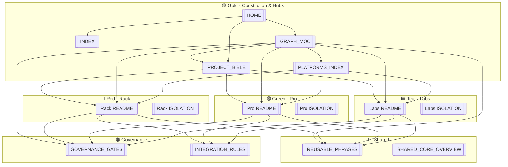

# Graph MOC · مركز الرسم المعرفي

![[03_SHARED_CORE/branding/benbenhub-logo.png|120]]

> [!important] **Start here for visual exploration · ابدأ من هنا لاستكشاف الرسم**
> **EN:** This note is the **recommended entry point** for Obsidian Graph View. Open it first → use the **legend** and **cluster filters** below → open **global graph** (`Ctrl+G`) or **local graph** from any platform MOC.  
> **AR:** هذه الملاحظة هي **نقطة البداية الموصى بها** لعرض الرسم. افتحها أولاً → استخدم **دليل الألوان** و**مرشحات الجزر** → الرسم العام أو المحلي من خريطة المنصة.

| Role | EN | AR | Open now |
|------|----|----|----------|
| **Visual hub** | You are here | أنت هنا | [[02_PLATFORMS/GRAPH_MOC]] |
| **Daily ops** | Command center | لوحة اليوم | [[00_ROOT_DASHBOARD/HOME]] |
| **Law** | Project Bible | الدستور | [[01_CONSTITUTION/PROJECT_BIBLE]] |
| **Vault map** | Full index | فهرس الخزنة | [[INDEX]] · [[README]] |
| **Platforms** | Island registry | سجل الجزر | [[02_PLATFORMS/PLATFORMS_INDEX]] |

#graph-hub #graph-moc #start-here #platforms #governance #constitution

---

## On this page · في هذه الصفحة

| # | Section | EN | AR |
|---|---------|----|----|
| 1 | [[#Quick start · بداية سريعة]] | 5-step Graph View | خطوات الرسم |
| 2 | [[#Legend · دليل الألوان والوسوم]] | Colors, tags, logos | الألوان والوسوم |
| 3 | [[#Gold cluster · عنقود الذهب]] | Constitution & hubs | الدستور والمراكز |
| 4 | [[#Red cluster · عنقود راك]] | Circuit Rack | سيركيت راك |
| 5 | [[#Green cluster · عنقود برو]] | Circuit Pro | سيركيت برو |
| 6 | [[#Teal cluster · عنقود لابز]] | Circuit Labs | سيركيت لابز |
| 7 | [[#Shared & governance clusters]] | Core + law | النواة والحوكمة |
| 8 | [[#Ecosystem mesh · شبكة المنظومة]] | Diagram | مخطط |
| 9 | [[#Master navigation · التنقل الرئيسي]] | All wikilinks | كل الروابط |
| 10 | [[#Graph filters · مرشحات الرسم]] | Copy-paste filters | مرشحات جاهزة |
| 11 | [[#Graph View best practices]] | Local · Global · Groups | أفضل الممارسات |

**Config:** `.obsidian/graph.json` · **CSS (optional):** Appearance → `benbenhub-visual-identity`

---

## Quick start · بداية سريعة

| Step | EN | AR | Action |
|:----:|----|----|--------|
| **0** | Pin this hub | ثبّت المركز | Bookmark [[02_PLATFORMS/GRAPH_MOC]] |
| **1** | Open hub | افتح المركز | This file |
| **2** | Reload colors | أعد الألوان | **Ctrl+P** → `Reload app without saving` |
| **3** | Global graph | الرسم العام | **Ctrl+G** |
| **4** | Pick a cluster | اختر جزيرة | Paste filter from [[#Graph filters · مرشحات الرسم]] |
| **5** | Local island | رسم محلي | Open platform README → **Ctrl+P** → `Graph view: Open local graph` |

**After git pull** that changes `graph.json`: reload **without saving** — do not overwrite groups from the Graph UI.

---

## Legend · دليل الألوان والوسوم

**EN:** Node colors = **path rules first** (top of list in Groups wins), then `color:` in frontmatter, then `#graph-color-*` tags. Logos appear in **Reading view** only; graph nodes are **titles + colors**.

**AR:** لون العقدة = **قواعد المسار أولاً**، ثم `color:`، ثم وسوم `#graph-color-*`. الشعارات في **وضع القراءة** فقط.

### Color legend | دليل الألوان

| Swatch | Entity | EN role | AR | Hex | Primary filter | `color:` | Tag fallback |
|:------:|--------|---------|-----|-----|----------------|----------|--------------|
| 🟡 | **Gold** | Constitution · hidden parent · vault hubs | دستور · أب مخفي · مراكز | `#FFD700` | `path:01_CONSTITUTION` | `[color:gold]` | `#graph-hub` |
| 🔴 | **Red** | Circuit Rack · commerce | راك · تجارة | `#E53935` | `path:02_PLATFORMS/rack` | `[color:red]` | `#graph-color-rack` |
| 🟢 | **Green** | Circuit Pro · identity & geo | برو · هوية | `#2E7D32` | `path:02_PLATFORMS/pro` | `[color:green]` | `#graph-color-pro` |
| 🟦 | **Teal** | Circuit Labs · knowledge | لابز · معرفة | `#009688` | `path:02_PLATFORMS/labs` | `[color:teal]` | `#graph-color-labs` |
| ⬜ | **Slate** | Shared core (thin services) | نواة مشتركة | `#9392AD` | `path:03_SHARED_CORE` | — | — |
| 🟠 | **Amber** | Governance · gates · integration law | حوكمة · بوابات | `#B7791F` | `path:04_GOVERNANCE` | — | — |

### Tag legend | دليل الوسوم

| Tag | Put on | EN | AR | Graph |
|-----|--------|----|----|-------|
| `#graph-hub` | **This file**, [[INDEX]], [[00_ROOT_DASHBOARD/HOME]], Bible only | Hub discovery | اكتشاف المركز | Gold |
| `#graph-moc` | Graph hub | Visual index | فهرس بصري | — |
| `#graph-color-rack` | All Rack folder notes | Red fallback | احتياطي أحمر | Red |
| `#graph-color-pro` | All Pro folder notes | Green fallback | احتياطي أخضر | Green |
| `#graph-color-labs` | All Labs folder notes | Teal fallback | احتياطي تركواز | Teal |
| `#platforms` | Platform indexes | Registry | سجل المنصات | — |

> [!warning] Platform MOC rule · قاعدة خريطة المنصة
> **Never** add `#graph-hub` to [[02_PLATFORMS/Rack/README]], [[02_PLATFORMS/Pro/README]], or [[02_PLATFORMS/Labs/README]] — it forces **gold** and hides island color.

**Branding SSOT:** [[01_CONSTITUTION/PROJECT_BIBLE#Branding & Visual Identity | الهوية البصرية]] · Assets: [[03_SHARED_CORE/branding/README]]

### Group priority (first match wins) | أولوية المجموعات

1. `path:02_PLATFORMS/rack` → 🔴  
2. `path:02_PLATFORMS/labs` → 🟦  
3. `path:02_PLATFORMS/pro` → 🟢  
4. `path:01_CONSTITUTION` → 🟡  
5. Hub paths (`INDEX`, `HOME`, `GRAPH_MOC`, `PLATFORMS_INDEX`, `README`, `00_ROOT_DASHBOARD`) → 🟡  
6. `[color:*]` · `tag:#graph-color-*`  
7. `tag:#graph-hub` → 🟡 (hub notes only)  
8. `path:03_SHARED_CORE` · `path:04_GOVERNANCE` → slate / amber  

---

## Gold cluster · عنقود الذهب — Constitution & hubs

**Filter:** `path:01_CONSTITUTION OR path:INDEX OR path:00_ROOT_DASHBOARD/HOME OR path:02_PLATFORMS/GRAPH_MOC OR path:02_PLATFORMS/PLATFORMS_INDEX`

**EN:** Law, vault entry, and navigation spine — open before changing any island.  
**AR:** القانون ومدخل الخزنة — افتح قبل تعديل أي جزيرة.

| Node | Wikilink |
|------|----------|
| Project Bible | [[01_CONSTITUTION/PROJECT_BIBLE]] |
| Constitution README | [[01_CONSTITUTION/README]] |
| Notion archive (audit) | [[01_CONSTITUTION/NOTION_SOURCE_ARCHIVE]] |
| Vision & philosophy | [[01_CONSTITUTION/PROJECT_BIBLE#Vision & Philosophy]] |
| Governance gates (Bible) | [[01_CONSTITUTION/PROJECT_BIBLE#Key Governance Gates]] |
| Platforms overview | [[01_CONSTITUTION/PROJECT_BIBLE#Platforms Overview]] |
| Branding & logos | [[01_CONSTITUTION/PROJECT_BIBLE#Branding & Visual Identity]] |
| Vault index | [[INDEX]] |
| Vault README | [[README]] |
| Daily home | [[00_ROOT_DASHBOARD/HOME]] |
| Platform registry | [[02_PLATFORMS/PLATFORMS_INDEX]] |
| Module database | [[02_PLATFORMS/FEATURES_MODULES_DATABASE]] |

![[03_SHARED_CORE/branding/benbenhub-logo.png|80]] *Parent palette — internal reference; no consumer umbrella UI.*

**Local graph tip:** Open [[01_CONSTITUTION/PROJECT_BIBLE]] → local graph → depth **2** to see Bible ↔ platform spokes.

---

## Red cluster · عنقود راك — Circuit Rack

**Filter:** `path:02_PLATFORMS/rack` · **Tag:** `tag:#graph-color-rack` · **Frontmatter:** `[color:red]`

**EN:** Primary commerce island — revenue engine, marketplace, bidding.  
**AR:** جزيرة التجارة الأساسية — سوق، مزادات، إيرادات.

| Doc | Wikilink |
|-----|----------|
| **Platform MOC** | [[02_PLATFORMS/Rack/README]] |
| Overview | [[02_PLATFORMS/Rack/OVERVIEW]] |
| Features & modules | [[02_PLATFORMS/Rack/FEATURES_MODULES]] |
| Isolation checklist | [[02_PLATFORMS/Rack/ISOLATION]] |
| Bible — Rack | [[01_CONSTITUTION/PROJECT_BIBLE#Circuit Rack \| سيركيت راك]] |
| Vision SSOT | [[01_CONSTITUTION/PROJECT_BIBLE#Rack Vision & Mission SSOT]] |
| Agreements SSOT | [[01_CONSTITUTION/PROJECT_BIBLE#Rack Key Agreements SSOT]] |
| Phrases `R-*` | [[03_SHARED_CORE/REUSABLE_PHRASES#Circuit Rack]] |

![[03_SHARED_CORE/branding/circuit-rack-logo.png|100]]

**Local graph:** [[02_PLATFORMS/Rack/README]] → `Open local graph` → filter `path:02_PLATFORMS/rack` in sidebar if needed.

---

## Green cluster · عنقود برو — Circuit Pro

**Filter:** `path:02_PLATFORMS/pro` · **Tag:** `tag:#graph-color-pro` · **Frontmatter:** `[color:green]`

**EN:** Identity, trust, geo, verification — no commerce SSOT on Pro.  
**AR:** هوية، ثقة، جغرافيا، تحقق — بلا SSOT تجارة على برو.

| Doc | Wikilink |
|-----|----------|
| **Platform MOC** | [[02_PLATFORMS/Pro/README]] |
| Overview | [[02_PLATFORMS/Pro/OVERVIEW]] |
| Features & modules | [[02_PLATFORMS/Pro/FEATURES_MODULES]] |
| Isolation checklist | [[02_PLATFORMS/Pro/ISOLATION]] |
| Bible — Pro | [[01_CONSTITUTION/PROJECT_BIBLE#Circuit Pro \| سيركيت برو]] |
| Vision SSOT | [[01_CONSTITUTION/PROJECT_BIBLE#Pro Vision & Mission SSOT]] |
| Agreements SSOT | [[01_CONSTITUTION/PROJECT_BIBLE#Pro Key Agreements SSOT]] |
| Phrases `P-*` | [[03_SHARED_CORE/REUSABLE_PHRASES#Circuit Pro]] |

![[03_SHARED_CORE/branding/circuit-pro-logo.png|100]]

**Local graph:** [[02_PLATFORMS/Pro/README]] → local graph.

---

## Teal cluster · عنقود لابز — Circuit Labs

**Filter:** `path:02_PLATFORMS/labs` · **Tag:** `tag:#graph-color-labs` · **Frontmatter:** `[color:teal]`

**EN:** Knowledge island — articles, learning, content SSOT.  
**AR:** جزيرة المعرفة — مقالات، تعلّم، محتوى.

| Doc | Wikilink |
|-----|----------|
| **Platform MOC** | [[02_PLATFORMS/Labs/README]] |
| Overview | [[02_PLATFORMS/Labs/OVERVIEW]] |
| Features & modules | [[02_PLATFORMS/Labs/FEATURES_MODULES]] |
| Isolation checklist | [[02_PLATFORMS/Labs/ISOLATION]] |
| Bible — Labs | [[01_CONSTITUTION/PROJECT_BIBLE#Circuit Labs \| سيركيت لابز]] |
| Vision SSOT | [[01_CONSTITUTION/PROJECT_BIBLE#Labs Vision & Mission SSOT]] |
| Agreements SSOT | [[01_CONSTITUTION/PROJECT_BIBLE#Labs Key Agreements SSOT]] |
| Phrases `L-*` | [[03_SHARED_CORE/REUSABLE_PHRASES#Circuit Labs]] |

![[03_SHARED_CORE/branding/circuit-labs-logo.png|100]]

**Local graph:** [[02_PLATFORMS/Labs/README]] → local graph.

---

## Shared & governance clusters · النواة والحوكمة

### Shared core · النواة المشتركة (slate `#9392AD`)

**Filter:** `path:03_SHARED_CORE`

| Doc | Wikilink |
|-----|----------|
| Overview | [[03_SHARED_CORE/SHARED_CORE_OVERVIEW]] |
| Phrase bank | [[03_SHARED_CORE/REUSABLE_PHRASES]] |
| Identity | [[03_SHARED_CORE/IDENTITY_SYSTEM]] |
| Wallet | [[03_SHARED_CORE/CIRCUIT_WALLET]] |
| Theme & i18n | [[03_SHARED_CORE/THEME_AND_I18N]] |
| Platform integration | [[03_SHARED_CORE/PLATFORM_INTEGRATION]] |
| Technical architecture | [[03_SHARED_CORE/TECHNICAL_ARCHITECTURE]] |
| Brand assets | [[03_SHARED_CORE/branding/README]] |

**Tip:** Add `-path:03_SHARED_CORE` to any filter when the graph is too dense.

### Governance · الحوكمة (amber `#B7791F`)

**Filter:** `path:04_GOVERNANCE`

| Doc | Wikilink |
|-----|----------|
| Three gates | [[04_GOVERNANCE/GOVERNANCE_GATES]] |
| Integration rules | [[04_GOVERNANCE/INTEGRATION_RULES]] |
| Decisions folder | [[04_GOVERNANCE/decisions/README]] |
| ADR index | [[91_DECISIONS/ADR_INDEX]] |
| Templates | [[90_TEMPLATES/TEMPLATES_INDEX]] |
| Bible — integration | [[01_CONSTITUTION/PROJECT_BIBLE#Platform Relationships & Backend Integration Rules]] |

---

## Ecosystem mesh · شبكة المنظومة



**ASCII spine:**

```
[[INDEX]] · [[HOME]] · [[02_PLATFORMS/GRAPH_MOC]]  ← START HERE
              │
       [[01_CONSTITUTION/PROJECT_BIBLE]]
         /        |        \
[[Rack/README]] [[Pro/README]] [[Labs/README]]
      \         |         /
       [[03_SHARED_CORE/REUSABLE_PHRASES]]
                 │
    [[04_GOVERNANCE/GOVERNANCE_GATES]] · [[04_GOVERNANCE/INTEGRATION_RULES]]
```

**Peer mesh (API-only · لا واجهة استهلاكية مشتركة):** Rack ↔ Pro (trust snapshots) · Rack ↔ Labs (catalog refs) · Pro ↔ Labs (profile refs) · all → [[04_GOVERNANCE/GOVERNANCE_GATES]] before cross-scope work.

---

## Master navigation · التنقل الرئيسي

| Layer | EN | Key links |
|-------|----|----|
| **Entry** | Start visual exploration | [[02_PLATFORMS/GRAPH_MOC]] · [[00_ROOT_DASHBOARD/HOME]] · [[INDEX]] |
| **Law** | Constitution | [[01_CONSTITUTION/PROJECT_BIBLE]] |
| **Islands** | Three platforms | [[02_PLATFORMS/Rack/README]] · [[02_PLATFORMS/Pro/README]] · [[02_PLATFORMS/Labs/README]] |
| **Registry** | Indexes | [[02_PLATFORMS/PLATFORMS_INDEX]] · [[02_PLATFORMS/FEATURES_MODULES_DATABASE]] |
| **Shared** | Thin core | [[03_SHARED_CORE/SHARED_CORE_OVERVIEW]] · [[03_SHARED_CORE/REUSABLE_PHRASES]] |
| **Governance** | Gates & decisions | [[04_GOVERNANCE/GOVERNANCE_GATES]] · [[04_GOVERNANCE/INTEGRATION_RULES]] · [[91_DECISIONS/ADR_INDEX]] |
| **Ops** | Daily | [[00_ROOT_DASHBOARD/DAILY/DAILY_INDEX]] · [[00_ROOT_DASHBOARD/PLATFORM_MAP]] · [[00_ROOT_DASHBOARD/QUICK_LINKS]] |

### Phrase bank · بنك الجمل

| Platform | Section | Prefix |
|----------|---------|--------|
| Shared | [[03_SHARED_CORE/REUSABLE_PHRASES#General / Shared]] | `G-*` |
| Rack | [[03_SHARED_CORE/REUSABLE_PHRASES#Circuit Rack]] | `R-*` |
| Pro | [[03_SHARED_CORE/REUSABLE_PHRASES#Circuit Pro]] | `P-*` |
| Labs | [[03_SHARED_CORE/REUSABLE_PHRASES#Circuit Labs]] | `L-*` |
| Isolation | [[03_SHARED_CORE/REUSABLE_PHRASES#Isolation & Governance]] | `I-*` · `GV-*` |

---

## Graph filters · مرشحات الرسم

Paste into Graph **search** (global **Ctrl+G** or local graph sidebar).

### Single cluster | عنقود واحد

| Cluster | Filter |
|---------|--------|
| 🔴 Rack | `path:02_PLATFORMS/rack` |
| 🟢 Pro | `path:02_PLATFORMS/pro` |
| 🟦 Labs | `path:02_PLATFORMS/labs` |
| 🟡 Constitution | `path:01_CONSTITUTION` |
| 🟡 Hubs only | `path:INDEX OR path:02_PLATFORMS/GRAPH_MOC OR path:02_PLATFORMS/PLATFORMS_INDEX OR path:00_ROOT_DASHBOARD/HOME` |
| ⬜ Shared | `path:03_SHARED_CORE` |
| 🟠 Governance | `path:04_GOVERNANCE` |
| Dashboard | `path:00_ROOT_DASHBOARD` |

### Combined views | عروض مركبة

| Goal | EN | Filter |
|------|----|--------|
| Three islands | All platforms | `path:02_PLATFORMS/rack OR path:02_PLATFORMS/pro OR path:02_PLATFORMS/labs` |
| Law + islands | Bible + MOCs | `path:01_CONSTITUTION OR path:02_PLATFORMS/rack OR path:02_PLATFORMS/pro OR path:02_PLATFORMS/labs` |
| Visual hub neighborhood | This file's star | Open [[02_PLATFORMS/GRAPH_MOC]] → **local graph** depth 2 |
| Less noise | Hide shared | `-(path:03_SHARED_CORE)` |
| Active SSOT only | Hide archives | `-path:05_ARCHIVES` |
| By property | Frontmatter | `[color:red]` · `[color:green]` · `[color:teal]` · `[color:gold]` |

---

## Graph View best practices · أفضل ممارسات الرسم

### Global graph · الرسم العام (`Ctrl+G`)

| Practice | EN | AR |
|----------|----|----|
| **Start from hub** | Open [[02_PLATFORMS/GRAPH_MOC]] first so wikilinks load the mesh | افتح المركز أولاً |
| **One cluster at a time** | Paste one filter from [[#Graph filters · مرشحات الرسم]] | مرشح واحد لكل مرة |
| **Groups ON** | Sidebar → **Groups** → enable rack, labs, pro, constitution (colored dots) | فعّل المجموعات |
| **Show tags** | ON — see `#graph-color-*` | الوسوم ظاهرة |
| **Show attachments** | OFF — avoids logo file nodes | أخفِ المرفقات |
| **Arrows** | ON — direction of dependencies | الأسهم للاتجاه |
| **Forces** | Slight repel if overlap; default usually fine | قوى افتراضية |

### Local graph · الرسم المحلي

| Start note | EN use case | Steps |
|------------|-------------|-------|
| [[02_PLATFORMS/GRAPH_MOC]] | Full hub star — constitution + 3 islands + governance | Open hub → **Ctrl+P** → `Graph view: Open local graph` → depth **2** |
| [[02_PLATFORMS/Rack/README]] | Commerce island only | Local graph → optional filter `path:02_PLATFORMS/rack` |
| [[02_PLATFORMS/Pro/README]] | Identity island only | Local graph |
| [[02_PLATFORMS/Labs/README]] | Knowledge island only | Local graph |
| [[01_CONSTITUTION/PROJECT_BIBLE]] | Legal neighborhood | Local graph depth **2–3** |

**EN:** Local graph = **focused 1–N hop** wikilink neighborhood — best for daily work on one island.  
**AR:** الرسم المحلي = جوار الروابط — الأفضل للعمل اليومي على جزيرة واحدة.

### Groups sidebar · مجموعات الألوان

| Check | Action |
|-------|--------|
| Vault root | Folder containing [[INDEX]] (`E:\BENBENHUB-CORE`) |
| After pull | `Reload app without saving` |
| All nodes gray | `git checkout -- .obsidian/graph.json` → reload → **do not save** from Graph UI |
| Platform wrong color | Remove `#graph-hub` from platform README |
| Minimum enabled | rack · labs · pro · constitution path groups |

| `graph.json` tuning | Value | Why |
|---------------------|-------|-----|
| `nodeSizeMultiplier` | 1.15 | Hubs slightly larger |
| `showTags` | true | Tag fallbacks visible |
| `showAttachments` | false | Cleaner graph |
| `showArrow` | true | Link direction |
| `collapse-color-groups` | false | Groups visible |

### Recommended sessions · جلسات موصى بها

| Session | Flow |
|---------|------|
| **Morning** | [[00_ROOT_DASHBOARD/HOME]] → today's daily → [[02_PLATFORMS/GRAPH_MOC]] → filter one island |
| **Architecture** | [[01_CONSTITUTION/PROJECT_BIBLE]] → local graph → [[04_GOVERNANCE/GOVERNANCE_GATES]] |
| **New ADR** | [[90_TEMPLATES/ADR_TEMPLATE]] → save under [[91_DECISIONS/ADR_INDEX]] → filter `path:04_GOVERNANCE OR path:91_DECISIONS` |
| **Branding** | [[90_TEMPLATES/BRANDING_GUIDELINE_TEMPLATE]] → filter `path:03_SHARED_CORE/branding` |

---

## Troubleshooting · استكشاف الأخطاء

| Symptom | Fix |
|---------|-----|
| All nodes gray | Restore `graph.json` from git → reload without saving |
| Rack/Pro/Labs gold instead of color | Remove `#graph-hub` from platform README |
| Colors reverted after edit | Obsidian saved empty groups — checkout `graph.json` again |
| Too many nodes | Add `-path:03_SHARED_CORE` or single-island filter |
| Logo nodes clutter | Turn off **Show attachments** |

---

*Maestro Graph Hub **v3.0** · Recommended visual start · [[01_CONSTITUTION/PROJECT_BIBLE]] ↔ [[02_PLATFORMS/PLATFORMS_INDEX]] ↔ [[03_SHARED_CORE/REUSABLE_PHRASES]] ↔ [[04_GOVERNANCE/GOVERNANCE_GATES]] · #graph-hub #graph-moc #start-here*