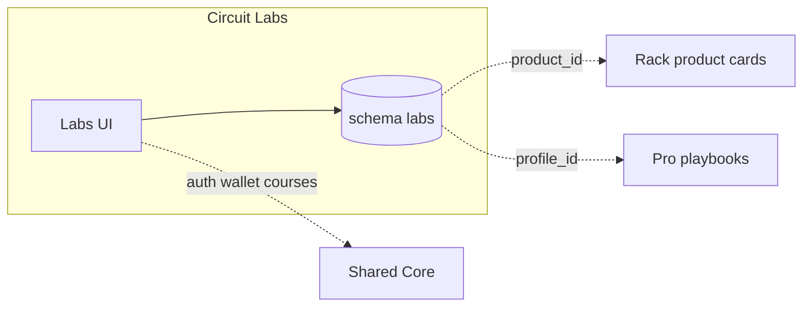

# Circuit Labs · سيركيت لابز

**Platform MOC · خريطة المنصة** — Sovereign knowledge island · جزيرة المعرفة

| | EN | AR |
|---|----|-----|
| **Tier** | Knowledge & learning | معرفة وتعلم |
| **Vault** | `02_PLATFORMS/labs/` | مجلد لابز |
| **Runtime** | `labs.*` · schema `labs` · green theme | نطاق لابز · مخطط معزول · أخضر |
| **SSOT owns** | Articles · courses · KB · learning paths | مقالات · دورات · قواعد معرفة · مسارات |

**Not a marketplace. Not identity SSOT.** · **ليس سوقاً. ليس SSOT للهوية.**

---

## Navigate this island · تنقل داخل الجزيرة

| Doc | EN | AR |
|-----|----|-----|
| **This MOC** | Start here | ابدأ هنا |
| [[02_PLATFORMS/labs/OVERVIEW]] | Short overview | نظرة مختصرة |
| [[02_PLATFORMS/labs/FEATURES_MODULES]] | L-C* · L-G* · L-P* modules | وحدات الميزات |
| [[02_PLATFORMS/labs/ISOLATION]] | Full isolation checklist | قائمة العزل |
| [[02_PLATFORMS/FEATURES_MODULES_DATABASE#Circuit Labs Modules]] | Global registry | السجل العام |

**Ecosystem:** [[02_PLATFORMS/PLATFORMS_INDEX]] · **Home:** [[00_ROOT_DASHBOARD/HOME]] · **Index:** [[INDEX]]

---

## PROJECT_BIBLE · الدستور (quick links)

| Topic | EN | AR | Section |
|-------|----|-----|---------|
| Platforms overview | Three islands index | فهرس الجزر | [[01_CONSTITUTION/PROJECT_BIBLE#Platforms Overview · نظرة عامة على المنصات]] |
| **Labs (canonical)** | Constitution summary | ملخص الدستور | [[01_CONSTITUTION/PROJECT_BIBLE#Circuit Labs · سيركيت لابز]] |
| Vision & mission | Full EN/AR in Bible | رؤية ومهمة | [[01_CONSTITUTION/PROJECT_BIBLE#Vision & Mission · الرؤية والمهمة]] |
| Features | L-C / L-G / L-P tiers | الميزات | [[01_CONSTITUTION/PROJECT_BIBLE#Features · الميزات]] |
| Stack | Runtime table | التقنية | [[01_CONSTITUTION/PROJECT_BIBLE#Stack]] |
| Isolation | Five+ rules | العزل | [[01_CONSTITUTION/PROJECT_BIBLE#Isolation]] |
| Relations | Peer matrix | العلاقات | [[01_CONSTITUTION/PROJECT_BIBLE#Relations]] |
| Integration law | Backend-only contracts | قانون التكامل | [[01_CONSTITUTION/PROJECT_BIBLE#Platform Relationships & Backend Integration Rules · العلاقات وقواعد التكامل الخلفي]] |
| Feature modules | Labs module list in Bible | وحدات لابز | [[01_CONSTITUTION/PROJECT_BIBLE#Circuit Labs — Feature Modules]] |
| Gates | Truth · Immutability · Scope | البوابات | [[01_CONSTITUTION/PROJECT_BIBLE#Governance Gates · بوابات الحوكمة]] |

---

## Vision & Mission · الرؤية والمهمة

### English

**Vision** — Industrial knowledge as **operational power** — documentation and learning that elevate manufacturing, not marketing noise.

**Mission** — Own **content and learning SSOT** (`article_id`, courses, knowledge bases). Publish and moderate under **Labs legal scope**. Reference Rack `product_id` and Pro `profile_id` via **stable API IDs only** — never embed sibling UI.

**Audience** — Writers, SMEs, learners; platforms consuming content APIs.

### العربية

**الرؤية** — المعرفة الصناعية **قوة تشغيلية** — توثيق وتعليم يرفع الصناعة، لا ضجيج تسويق.

**المهمة** — امتلاك **SSOT** المحتوى والتعلم. النشر والإشراف ضمن **قانون Labs**. الإشارة إلى `product_id` و `profile_id` عبر **معرّفات API** فقط.

**الجمهور** — كتّاب، خبراء، متعلمون؛ منصات تستهلك APIs محتوى.

---

## Key Features · الميزات الرئيسية

### Content core · نواة المحتوى (L-C*)

| Feature | EN | AR |
|---------|----|-----|
| Publishing workflow | Draft → review → publish | سير تحرير |
| Knowledge bases | Structured KB articles | قواعد معرفة |
| Corpus search | Labs-owned content index | بحث في المحتوى |
| Asset library | Media tied to `labs` schema | مكتبة أصول |

### Community & growth · مجتمع ونمو (L-G*)

| Feature | EN | AR |
|---------|----|-----|
| Moderation | Policy enforcement | إشراف |
| Learning paths | Curated sequences | مسارات تعلم |
| Cross-ref APIs | `product_id` · `profile_id` metadata | APIs مرجعية |
| Versioning | Content lifecycle | دورة حياة المحتوى |

### Power · قوة (L-P*)

| Feature | EN | AR |
|---------|----|-----|
| Paid courses | Wallet gated · `platform_source=labs` | دورات مدفوعة |
| Academy (future) | Gated roadmap item | أكاديمية (مستقبل) |
| Partner content API | B2B syndication (gated) | API شركاء محتوى |

**Detail:** [[02_PLATFORMS/labs/FEATURES_MODULES]] · **Registry:** [[02_PLATFORMS/FEATURES_MODULES_DATABASE#Circuit Labs Modules]]

**Phrases:** `L-*` in [[03_SHARED_CORE/REUSABLE_PHRASES]] · **Roles:** `editor` · `support_agent`

---

## Technical Stack · التقنية

### English

| Layer | Stack | Notes |
|-------|--------|-------|
| **Languages** | TypeScript, SQL | Platform slice |
| **Frontend** | Next.js · `platforms/labs/app` | Green · reading-first UX |
| **Backend** | Node.js | Publishing, content, KB services |
| **Database** | PostgreSQL · schema `labs` | Articles, courses, assets |
| **Auth** | → [[03_SHARED_CORE/IDENTITY_SYSTEM]] | Editorial roles |
| **Search** | Labs-owned corpus index | Not Rack product index |
| **Wallet** | Paid courses (gated) | `platform_source=labs` |
| **Deploy** | `labs.*` · **independent CI** | Content releases decoupled from Rack |
| **i18n** | Labs-owned editorial strings | — |

### العربية

| الطبقة | المكدس | ملاحظات |
|--------|--------|---------|
| **الواجهة** | Next.js · أخضر | تجربة قراءة |
| **الخلفية** | Node.js | نشر ومحتوى |
| **البيانات** | `labs` | نصوص المقالات/الدورات هنا فقط |
| **النشر** | `labs.*` · CI مستقل | مستقل عن دورات راك |

**Architecture:** [[03_SHARED_CORE/TECHNICAL_ARCHITECTURE#Circuit Labs Runtime]] · **Bible:** [[01_CONSTITUTION/PROJECT_BIBLE#Stack]]

---

## Isolation Rules · قواعد العزل

| # | EN | AR |
|---|----|-----|
| 1 | **UI** — No Rack commerce, bidding, or checkout on Labs | **واجهة** — لا تجارة راك على Labs |
| 2 | **UI** — No Pro profile editor / geo UI on Labs | لا محرر Pro على Labs |
| 3 | **Data** — Not SSOT for price, inventory, or verification | **بيانات** — ليس SSOT للسعر أو التحقق |
| 4 | **Refs** — Rack/Pro via API metadata · **no iframes** | **مراجع** — API فقط · لا iframe |
| 5 | **Deploy** — Content cadence independent of Rack marketplace | **نشر** — مستقل عن راك |
| 6 | **Content** — Article/course bodies **only** in `labs` schema | **محتوى** — النص في labs فقط |

**Full:** [[02_PLATFORMS/labs/ISOLATION]] · **Law:** [[04_GOVERNANCE/INTEGRATION_RULES]] · **Gates:** [[04_GOVERNANCE/GOVERNANCE_GATES]]

---

## Relationships to Other Platforms · العلاقات

### Peer matrix · مصفوفة الأقران

| Peer | Allowed | Forbidden |
|------|---------|-----------|
| **Rack** | Guides with `product_id`; Rack reads summary API | Labs hosting Rack checkout/CMS |
| **Pro** | Playbooks link `profile_id` | Labs storing verification SSOT |
| **Shared core** | Auth, theme, i18n, wallet (courses) | Content SSOT in core |
| **BENBENHUB** | Gates, ADRs | Cross-brand public knowledge hub |

### Integration flows · تدفقات

| Flow | EN | AR |
|------|----|-----|
| **Product guides** | Labs `{article_id, product_id}` → Rack **link card** (Rack UI only) | دليل → بطاقة في راك فقط |
| **Expert playbooks** | `profile_id` in content · Pro remains verification SSOT | أدلة خبراء · التحقق في Pro |

**Siblings:** [[02_PLATFORMS/rack/README]] · [[02_PLATFORMS/pro/README]]

---

## SSOT & data ownership · ملكية الحقيقة

| Domain | Owner | Others may |
|--------|-------|------------|
| Articles & courses | **Labs** | API summaries |
| KB structure | **Labs** | — |
| Product truth | Rack | Labs references `product_id` |
| Verification | Pro | Labs references `profile_id` |
| Pricing / orders | Rack | Labs never stores |
| User auth | Shared core (gated) | — |

---

## Before you ship · قبل الشحن

| Check | EN | AR |
|-------|----|-----|
| Scope | Labs editorial & schema only | ضمن Labs فقط |
| Gates | New Rack/Pro surface? [[04_GOVERNANCE/GOVERNANCE_GATES]] | واجهة جديدة؟ البوابات |
| Copy | `L-*` phrases | جمل لابز |
| Bible | [[01_CONSTITUTION/PROJECT_BIBLE#Circuit Labs · سيركيت لابز]] aligned | توافق الدستور |

---

*Maestro · Labs MOC · [[01_CONSTITUTION/PROJECT_BIBLE#Circuit Labs · سيركيت لابز]] · [[02_PLATFORMS/PLATFORMS_INDEX]]*