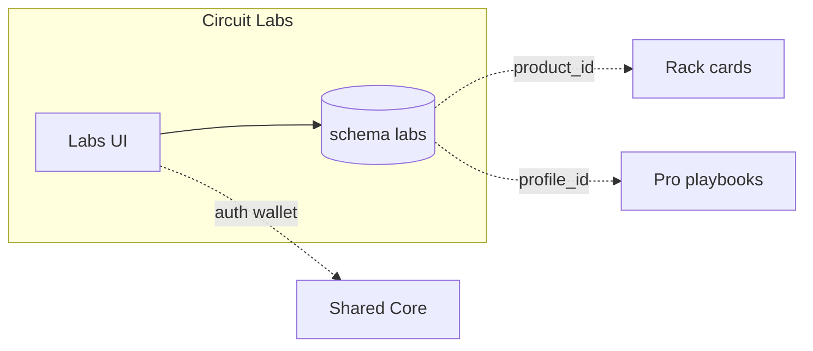

# Circuit Labs · سيركيت لابز

**Platform MOC · خريطة المنصة**

| | EN | AR |
|---|----|-----|
| **Tier** | Knowledge & learning | معرفة وتعلم |
| **Vault** | `02_PLATFORMS/labs/` | مجلد لابز |
| **Runtime** | `labs.*` · schema `labs` · green theme | نطاق لابز · مخطط معزول · أخضر |
| **SSOT owns** | Articles · courses · KB · learning paths | مقالات · دورات · قواعد معرفة · مسارات |

**EN:** Sovereign knowledge island — operational documentation and learning, not marketplace or identity SSOT.  
**AR:** جزيرة معرفة سيادية — توثيق وتعليم تشغيلي، وليست سوقاً ولا مصدر حقيقة للهوية.

> **Strategic SSOT flow | مسار مصدر الحقيقة**  
> **EN:** [[01_CONSTITUTION/PROJECT_BIBLE]] = full Vision, Mission & Agreements · this README = summary + operational MOC.  
> **AR:** [[01_CONSTITUTION/PROJECT_BIBLE]] = الرؤية والمهمة والاتفاقات الكاملة · هذا الملف = ملخص + خريطة تشغيل.

---

## Vision & Mission | الرؤية والمهمة

<!-- VISION MISSION SUMMARY — do not duplicate; SSOT in PROJECT_BIBLE -->

| | EN | AR |
|---|----|-----|
| **Vision** | Industrial knowledge as operational power — not marketing noise | معرفة صناعية قوة تشغيلية — بلا ضجيج تسويقي |
| **Mission** | Own content & learning SSOT; publish under Labs law; API refs only | امتلاك SSOT المحتوى والتعلم؛ نشر ضمن قانون Labs؛ مراجع API |
| **Audience** | Writers, SMEs, learners, API consumers | كتّاب وخبراء ومتعلمون ومستهلكو API |

**Full strategic SSOT →** [[01_CONSTITUTION/PROJECT_BIBLE#Labs Vision & Mission SSOT | لابز — الرؤية والمهمة (SSOT)]]

---

## Key Agreements & User Approvals | الاتفاقات (ملخص)

<!-- AGREEMENTS SUMMARY — do not duplicate; SSOT in PROJECT_BIBLE -->

**EN:** Labs-scoped consents — contributor, content policy, cross-ref accuracy, paid courses (gated). Versioned content; no silent rewrites.

**AR:** موافقات Labs — مساهم، سياسة محتوى، دقة مراجع عابرة، دورات مدفوعة (مقيد). محتوى بنسخ؛ بلا تحريف صامت.

**Full consent registry →** [[01_CONSTITUTION/PROJECT_BIBLE#Labs Key Agreements SSOT | لابز — الاتفاقات (SSOT)]] · **Law:** [[01_CONSTITUTION/PROJECT_BIBLE#Legal & Consents · القانوني والموافقات]]

---

## Navigate this island | تنقل داخل الجزيرة

| Doc | EN | AR |
|-----|----|-----|
| **This MOC** | Start here | ابدأ هنا |
| [[02_PLATFORMS/labs/OVERVIEW]] | Short overview | نظرة مختصرة |
| [[02_PLATFORMS/labs/FEATURES_MODULES]] | L-C* · L-G* · L-P* | وحدات الميزات |
| [[02_PLATFORMS/labs/ISOLATION]] | Full isolation checklist | قائمة العزل |

**Ecosystem:** [[02_PLATFORMS/PLATFORMS_INDEX]] · [[00_ROOT_DASHBOARD/HOME]] · [[INDEX]]

---

## PROJECT_BIBLE | الدستور (quick links)

| Topic | Link |
|-------|------|
| Labs section | [[01_CONSTITUTION/PROJECT_BIBLE#Circuit Labs \| سيركيت لابز]] |
| Vision & mission (SSOT) | [[01_CONSTITUTION/PROJECT_BIBLE#Labs Vision & Mission SSOT \| لابز — الرؤية والمهمة]] |
| Agreements (SSOT) | [[01_CONSTITUTION/PROJECT_BIBLE#Labs Key Agreements SSOT \| لابز — الاتفاقات]] |
| Features | [[01_CONSTITUTION/PROJECT_BIBLE#Features \| الميزات]] |
| Isolation | [[01_CONSTITUTION/PROJECT_BIBLE#Isolation \| العزل]] |
| Gates | [[01_CONSTITUTION/PROJECT_BIBLE#Key Governance Gates \| بوابات الحوكمة]] |

---

<!-- BUSINESS RULES SECTION -->

## Business Rules & Roles | قواعد العمل والأدوار

### Roles | الأدوار

| Role | EN responsibility | AR | Scope |
|------|---------------------|-----|-------|
| `reader` | Consume KB, guides, learning paths | قراءة المعرفة والمسارات | Labs consumer |
| `editor` | Draft, submit, revise content (versioned) | صياغة ومراجعة محتوى | L-C* editorial |
| `support_agent` | Support workflows — no commerce SSOT | دعم دون SSOT تجارة | L-G* |
| `moderator` | Enforce content policy, takedowns with audit | إشراف وسحب بسجل | Labs compliance |
| `course_instructor` | Paid courses (gated, L-P*) | دورات مدفوعة | Power + wallet consent |
| `labs_admin` | Editorial policy, API publication | سياسة تحرير ونشر API | Labs admin |

### Business rules | قواعد العمل

| # | EN rule | AR | Gate |
|---|---------|-----|------|
| 1 | Article and course bodies SSOT in schema `labs` only | نصوص المحتوى في `labs` فقط | Scope |
| 2 | `product_id` / `profile_id` are references — fetch metadata via API, no iframe | مراجع عبر API دون iframe | Scope |
| 3 | No listing price, inventory, or `verified_pro` state in Labs DB | لا سعر ولا مخزون ولا تحقق في Labs | Truth |
| 4 | Moderation actions logged — retract with reason, not silent delete | إشراف بسجل وسبب | Immutability |
| 5 | Paid courses: `platform_source=labs` wallet rules + separate consent | دورات مدفوعة بوسم وموافقة | Scope |
| 6 | Rack may show guide cards from Labs API — Labs must not host Rack cart | راك يعرض بطاقات — Labs لا تستضيف سلة راك | Scope |

---

## Key Features | الميزات الرئيسية

**EN:** **Core (L-C*)** — publishing workflow, knowledge bases, corpus search, asset library, moderation. **Growth (L-G*)** — learning paths, support-agent workflows, cross-ref APIs (`product_id`, `profile_id`), content versioning. **Power (L-P*)** — paid courses via wallet (gated, `platform_source=labs`), future Academy, partner content API. Modules: M-001 Identity, M-003 Search (Labs index), M-004 Wallet (courses), M-005 linking. Roles: `editor`, `support_agent`.

**AR:** **الأساسي (L-C*)** — سير نشر، قواعد معرفة، بحث في المحتوى، مكتبة أصول، إشراف. **النمو (L-G*)** — مسارات تعلم، سير عمل وكلاء الدعم، واجهات مرجعية (`product_id`، `profile_id`)، وإصدارات المحتوى. **القوة (L-P*)** — دورات مدفوعة عبر المحفظة (مقيدة، `platform_source=labs`)، أكاديمية مستقبلية، وAPI شركاء محتوى. الوحدات: M-001 الهوية، M-003 البحث (فهرس Labs)، M-004 المحفظة (دورات)، M-005 الربط. الأدوار: `editor`، `support_agent`.

| Tier | EN | AR |
|------|----|-----|
| L-C* | Publishing · KB · search · moderation | نشر · قواعد معرفة · بحث · إشراف |
| L-G* | Learning paths · cross-ref APIs | مسارات · مراجع API |
| L-P* | Paid courses · Academy (gated) | دورات مدفوعة · أكاديمية |

**Detail:** [[02_PLATFORMS/labs/FEATURES_MODULES]] · **Phrases:** `L-*` in [[03_SHARED_CORE/REUSABLE_PHRASES]]

---

## Technical Stack | التقنية

**EN:** TypeScript and SQL. Frontend: Next.js at `platforms/labs/app`, green theme, reading-first UX. Backend: Node.js for publishing, content, and KB services. Database: PostgreSQL schema `labs` for articles, courses, and assets. Auth via [[03_SHARED_CORE/IDENTITY_SYSTEM]] with editorial roles. Labs-owned corpus search index. Deploy on `labs.*` with independent CI — content cadence decoupled from Rack marketplace. Wallet for paid courses when gated.

**AR:** TypeScript وSQL. الواجهة: Next.js في `platforms/labs/app` بثيم أخضر وتجربة قراءة. الخلفية: Node.js لخدمات النشر والمحتوى وقواعد المعرفة. قاعدة البيانات: مخطط PostgreSQL `labs` للمقالات والدورات والأصول. المصادقة عبر [[03_SHARED_CORE/IDENTITY_SYSTEM]] بأدوار تحريرية. فهرس بحث المحتوى مملوك لـ Labs. النشر على `labs.*` بـ CI مستقل — إيقاع المحتوى منفصل عن سوق راك. محفظة للدورات المدفوعة عند الموافقة.

**Architecture:** [[03_SHARED_CORE/TECHNICAL_ARCHITECTURE#Circuit Labs Runtime]]

---

## Isolation Rules | قواعد العزل

**EN:** (1) **UI** — No Rack commerce, bidding, or checkout on Labs; no Pro profile editor or geo UI. (2) **Data** — Not SSOT for price, inventory, or verification status. (3) **Refs** — Rack/Pro entities via API metadata only; no iframes or shared routes. (4) **Deploy** — Content releases independent of Rack marketplace cycles. (5) **Content** — Article and course bodies stay in `labs` schema only.

**AR:** (1) **الواجهة** — ممنوع تجارة راك والمزايدة والدفع على Labs؛ ممنوع محرر ملف Pro أو واجهة جغرافية. (2) **البيانات** — ليس SSOT للسعر أو المخزون أو حالة التحقق. (3) **المراجع** — كيانات راك/Pro عبر بيانات API فقط؛ لا iframe ولا مسارات مشتركة. (4) **النشر** — إصدارات المحتوى مستقلة عن دورات سوق راك. (5) **المحتوى** — نصوص المقالات والدورات في مخطط `labs` فقط.

**Full:** [[02_PLATFORMS/labs/ISOLATION]] · **Law:** [[04_GOVERNANCE/INTEGRATION_RULES]]

---

## Relationships to Other Platforms | العلاقات

**EN:** **Rack** — guides reference `product_id`; Rack reads summary API; forbidden: Labs hosting Rack checkout or CMS. **Pro** — playbooks link `profile_id`; forbidden: Labs storing verification SSOT. **Shared core** — auth, theme, i18n, wallet for courses; forbidden: content SSOT in core. **BENBENHUB** — gates only. **Flow:** Labs guide `{article_id, product_id}` → link card on Rack UI only.

**AR:** **Rack** — الأدلة تربط `product_id`؛ راك يقرأ ملخص API؛ ممنوع: Labs تستضيف دفع راك أو CMS. **Pro** — أدلة تربط `profile_id`؛ ممنوع: Labs تخزن SSOT التحقق. **النواة** — هوية وثيم وترجمة ومحفظة للدورات؛ ممنوع: SSOT المحتوى في النواة. **BENBENHUB** — بوابات فقط. **التدفق:** دليل Labs `{article_id, product_id}` → بطاقة رابط في واجهة راك فقط.

**Siblings:** [[02_PLATFORMS/rack/README]] · [[02_PLATFORMS/pro/README]]

---

## SSOT & Data Ownership | ملكية الحقيقة

**EN:** Labs owns articles, courses, KB structure, and editorial lifecycle. Rack owns product truth. Pro owns verification. Shared core holds auth when gated.

**AR:** Labs يملك المقالات والدورات وهيكل قواعد المعرفة ودورة المحتوى. راك يملك حقيقة المنتج. Pro يملك التحقق. النواة تحتفظ بالمصادقة عند الموافقة.

---

## Before You Ship | قبل الشحن

**EN:** Stay within Labs editorial scope; gate new Rack/Pro surfaces; use `L-*` phrases; align [[01_CONSTITUTION/PROJECT_BIBLE#Circuit Labs \| سيركيت لابز]] if law changes.

**AR:** ابقَ ضمن نطاق Labs التحريري؛ مرّر البوابات لأي سطح جديد مع راك/Pro؛ استخدم جمل `L-*`؛ حدّث الدستور إن تغيّر القانون.

---

*Maestro · Labs MOC · [[01_CONSTITUTION/PROJECT_BIBLE#Circuit Labs \| سيركيت لابز]]*