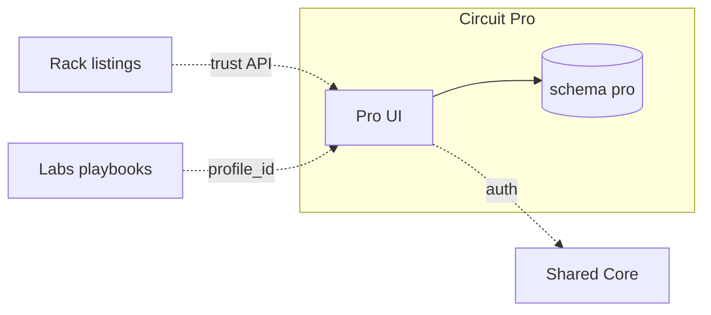

# Circuit Pro · سيركيت برو

**Platform MOC · خريطة المنصة**

| | EN | AR |
|---|----|-----|
| **Tier** | Services & professionals | خدمات ومهنيون |
| **Vault** | `02_PLATFORMS/pro/` | مجلد برو |
| **Runtime** | `pro.*` · schema `pro` · purple theme | نطاق برو · مخطط معزول · بنفسجي |
| **SSOT owns** | Profile · verification · reputation · geo | ملف · تحقق · سمعة · جغرافيا |

**EN:** Sovereign professional and geo island — not commerce, not content publishing.  
**AR:** جزيرة مهنية وجغرافية سيادية — ليست تجارة ولا نشر محتوى.

---

## Navigate this island | تنقل داخل الجزيرة

| Doc | EN | AR |
|-----|----|-----|
| **This MOC** | Start here | ابدأ هنا |
| [[02_PLATFORMS/pro/OVERVIEW]] | Short overview | نظرة مختصرة |
| [[02_PLATFORMS/pro/FEATURES_MODULES]] | P-C* · P-G* · P-P* | وحدات الميزات |
| [[02_PLATFORMS/pro/ISOLATION]] | Full isolation checklist | قائمة العزل |

**Ecosystem:** [[02_PLATFORMS/PLATFORMS_INDEX]] · [[00_ROOT_DASHBOARD/HOME]] · [[INDEX]]

---

## PROJECT_BIBLE | الدستور (quick links)

| Topic | Link |
|-------|------|
| Pro section | [[01_CONSTITUTION/PROJECT_BIBLE#Circuit Pro \| سيركيت برو]] |
| Vision & mission | [[01_CONSTITUTION/PROJECT_BIBLE#Vision & Mission \| الرؤية والمهمة]] |
| Features | [[01_CONSTITUTION/PROJECT_BIBLE#Features \| الميزات]] |
| Isolation | [[01_CONSTITUTION/PROJECT_BIBLE#Isolation \| العزل]] |
| Gates | [[01_CONSTITUTION/PROJECT_BIBLE#Key Governance Gates \| بوابات الحوكمة]] |

---

## Vision & Mission | الرؤية والمهمة

**EN:** **Vision** — A trusted professional and geo-service layer for industrial ecosystems, without owning commerce or editorial content. **Mission** — Own profile, verification, and reputation SSOT. Deliver discovery and trust APIs for Rack and Labs. Never host marketplace checkout, product catalog, or Labs CMS. **Audience** — Engineers, consultants, field services, and organizations seeking verified regional expertise.

**AR:** **الرؤية** — طبقة مهنية وجغرافية موثوقة للمنظومة الصناعية دون امتلاك التجارة أو المحتوى التحريري. **المهمة** — امتلاك مصدر الحقيقة للملف المهني والتحقق والسمعة، وتقديم واجهات اكتشاف وثقة لـ Rack وLabs، مع منع استضافة دفع السوق أو كتالوج المنتجات أو نظام إدارة محتوى Labs. **الجمهور** — مهندسون ومستشارون وخدمات ميدانية وجهات تبحث خبرة إقليمية موثقة.

---

## Key Features | الميزات الرئيسية

**EN:** **Core (P-C*)** — professional profiles, verification workflow (`verified_pro`), reputation signals, discovery search. **Growth (P-G*)** — regional discovery, service areas, portfolios, backend referrals, indexing API for Rack/Labs. **Power (P-P*)** — advanced trust scoring, `regional_agent` role, partner API (gated). Modules: M-001 Identity, M-003 Search (Pro index), M-004 Wallet (optional), M-005 linking.

**AR:** **الأساسي (P-C*)** — ملفات مهنية، سير تحقق (`verified_pro`)، إشارات سمعة، وبحث اكتشاف. **النمو (P-G*)** — اكتشاف إقليمي، نطاق خدمة، معارض خبرات، إحالات خلفية، وفهرسة لـ Rack/Labs. **القوة (P-P*)** — درجات ثقة متقدمة، دور `regional_agent`، وAPI شركاء (مقيد). الوحدات: M-001 الهوية، M-003 البحث (فهرس Pro)، M-004 المحفظة (اختياري)، M-005 الربط.

| Tier | EN | AR |
|------|----|-----|
| P-C* | Profiles · verification · reputation | ملف · تحقق · سمعة |
| P-G* | Geo · portfolios · indexing API | جغرافيا · معارض · فهرسة |
| P-P* | Trust scoring · regional agent (gated) | ثقة · وكيل إقليمي |

**Detail:** [[02_PLATFORMS/pro/FEATURES_MODULES]] · **Phrases:** `P-*` in [[03_SHARED_CORE/REUSABLE_PHRASES]]

---

## Technical Stack | التقنية

**EN:** TypeScript and SQL. Frontend: Next.js at `platforms/pro/app`, purple theme, discovery-first UX. Backend: Node.js for profile, verification, and geo services. Database: PostgreSQL schema `pro` only — Rack/Labs tables are never Pro SSOT. Auth via [[03_SHARED_CORE/IDENTITY_SYSTEM]] with roles `verified_pro` and `regional_agent`. Pro-owned professional/geo search index. Deploy on `pro.*` with independent CI and boundary scan. Optional wallet with `platform_source=pro` when gated.

**AR:** TypeScript وSQL. الواجهة: Next.js في `platforms/pro/app` بثيم بنفسجي وتجربة اكتشاف. الخلفية: Node.js لخدمات الملف والتحقق والجغرافيا. قاعدة البيانات: مخطط PostgreSQL `pro` فقط — جداول Rack/Labs ليست SSOT لـ Pro. المصادقة عبر [[03_SHARED_CORE/IDENTITY_SYSTEM]] بأدوار `verified_pro` و`regional_agent`. فهرس بحث مهني/جغرافي مملوك لـ Pro. النشر على `pro.*` بـ CI مستقل وفحص حدود. محفظة اختيارية بوسم `platform_source=pro` عند الموافقة.

**Architecture:** [[03_SHARED_CORE/TECHNICAL_ARCHITECTURE#Circuit Pro Runtime]]

---

## Isolation Rules | قواعد العزل

**EN:** (1) **UI** — No Rack catalog, cart, bidding, or checkout on Pro; no Labs editor/CMS chrome. (2) **Data** — No Rack `products`/`orders` or Labs `articles` as Pro SSOT. (3) **API** — Export profile and reputation only through versioned contracts. (4) **Deploy** — Independent of Rack traffic spikes and Labs content releases. (5) **Verification** — Canonical state in Pro; siblings read snapshots only.

**AR:** (1) **الواجهة** — ممنوع كتالوج راك والسلة والمزايدة والدفع على Pro؛ ممنوع محرر/CMS Labs. (2) **البيانات** — ممنوع جداول منتجات/طلبات راك أو مقالات Labs كـ SSOT لـ Pro. (3) **API** — تصدير الملف والسمعة عبر عقود نسخة فقط. (4) **النشر** — مستقل عن ذروات راك وإصدارات محتوى Labs. (5) **التحقق** — الحالة القانونية في Pro؛ الأقران يقرؤون لقطات فقط.

**Full:** [[02_PLATFORMS/pro/ISOLATION]] · **Law:** [[04_GOVERNANCE/INTEGRATION_RULES]]

---

## Relationships to Other Platforms | العلاقات

**EN:** **Rack** — `GET /profiles/{id}/trust` for listings; forbidden: Rack UI on Pro, Pro hosting checkout. **Labs** — playbooks link `profile_id`; forbidden: Labs owning verification. **Shared core** — auth, optional wallet, theme; forbidden: profile SSOT in core tables. **BENBENHUB** — gates only. **Flow:** verification event → Rack badge via API, no iframe.

**AR:** **Rack** — `GET /profiles/{id}/trust` للقوائم؛ ممنوع: واجهة راك على Pro أو دفع Pro. **Labs** — أدلة تربط `profile_id`؛ ممنوع: Labs تملك التحقق. **النواة** — هوية ومحفظة وثيم؛ ممنوع: SSOT الملف في جداول النواة. **BENBENHUB** — بوابات فقط. **التدفق:** حدث تحقق → شارة راك عبر API دون iframe.

**Siblings:** [[02_PLATFORMS/rack/README]] · [[02_PLATFORMS/labs/README]]

---

## SSOT & Data Ownership | ملكية الحقيقة

**EN:** Pro owns profiles, verification, reputation, and geo service areas. Rack owns products and orders. Labs owns articles and courses. Shared core holds auth when gated.

**AR:** Pro يملك الملفات والتحقق والسمعة ونطاقات الخدمة الجغرافية. راك يملك المنتجات والطلبات. Labs يملك المقالات والدورات. النواة تحتفظ بالمصادقة عند الموافقة.

---

## Before You Ship | قبل الشحن

**EN:** Stay within Pro slice; gate any new Rack/Labs contract; use `P-*` phrases; align [[01_CONSTITUTION/PROJECT_BIBLE#Circuit Pro \| سيركيت برو]] if law changes.

**AR:** ابقَ ضمن شريحة Pro؛ مرّر البوابات لأي عقد جديد مع راك/Labs؛ استخدم جمل `P-*`؛ حدّث الدستور إن تغيّر القانون.

---

*Maestro · Pro MOC · [[01_CONSTITUTION/PROJECT_BIBLE#Circuit Pro \| سيركيت برو]]*