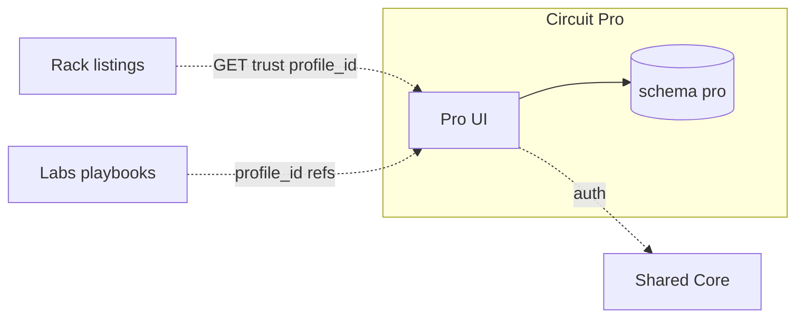

# Circuit Pro · سيركيت برو

**Platform MOC · خريطة المنصة** — Sovereign professional & geo island · جزيرة الهوية والجغرافيا

| | EN | AR |
|---|----|-----|
| **Tier** | Services & professionals | خدمات ومهنيون |
| **Vault** | `02_PLATFORMS/pro/` | مجلد برو |
| **Runtime** | `pro.*` · schema `pro` · purple theme | نطاق برو · مخطط معزول · بنفسجي |
| **SSOT owns** | Profile · verification · reputation · geo discovery | ملف · تحقق · سمعة · اكتشاف جغرافي |

**Not commerce. Not content publishing.** · **ليس تجارة. ليس نشر محتوى.**

---

## Navigate this island · تنقل داخل الجزيرة

| Doc | EN | AR |
|-----|----|-----|
| **This MOC** | Start here | ابدأ هنا |
| [[02_PLATFORMS/pro/OVERVIEW]] | Short overview | نظرة مختصرة |
| [[02_PLATFORMS/pro/FEATURES_MODULES]] | P-C* · P-G* · P-P* modules | وحدات الميزات |
| [[02_PLATFORMS/pro/ISOLATION]] | Full isolation checklist | قائمة العزل |
| [[02_PLATFORMS/FEATURES_MODULES_DATABASE#Circuit Pro Modules]] | Global registry | السجل العام |

**Ecosystem:** [[02_PLATFORMS/PLATFORMS_INDEX]] · **Home:** [[00_ROOT_DASHBOARD/HOME]] · **Index:** [[INDEX]]

---

## PROJECT_BIBLE · الدستور (quick links)

| Topic | EN | AR | Section |
|-------|----|-----|---------|
| Platforms overview | Three islands index | فهرس الجزر | [[01_CONSTITUTION/PROJECT_BIBLE#Platforms Overview · نظرة عامة على المنصات]] |
| **Pro (canonical)** | Constitution summary | ملخص الدستور | [[01_CONSTITUTION/PROJECT_BIBLE#Circuit Pro · سيركيت برو]] |
| Vision & mission | Full EN/AR in Bible | رؤية ومهمة | [[01_CONSTITUTION/PROJECT_BIBLE#Vision & Mission · الرؤية والمهمة]] |
| Features | P-C / P-G / P-P tiers | الميزات | [[01_CONSTITUTION/PROJECT_BIBLE#Features · الميزات]] |
| Stack | Runtime table | التقنية | [[01_CONSTITUTION/PROJECT_BIBLE#Stack]] |
| Isolation | Five+ rules | العزل | [[01_CONSTITUTION/PROJECT_BIBLE#Isolation]] |
| Relations | Peer matrix | العلاقات | [[01_CONSTITUTION/PROJECT_BIBLE#Relations]] |
| Integration law | Backend-only contracts | قانون التكامل | [[01_CONSTITUTION/PROJECT_BIBLE#Platform Relationships & Backend Integration Rules · العلاقات وقواعد التكامل الخلفي]] |
| Feature modules | Pro module list in Bible | وحدات برو | [[01_CONSTITUTION/PROJECT_BIBLE#Circuit Pro — Feature Modules]] |
| Gates | Truth · Immutability · Scope | البوابات | [[01_CONSTITUTION/PROJECT_BIBLE#Governance Gates · بوابات الحوكمة]] |

---

## Vision & Mission · الرؤية والمهمة

### English

**Vision** — A trusted **professional and geo-service layer** for industrial ecosystems — without owning commerce or editorial content.

**Mission** — Own **profile, verification, and reputation SSOT**. Deliver discovery and trust APIs for Rack and Labs. **Never** host marketplace checkout, product catalog, or Labs CMS.

**Audience** — Engineers, consultants, field services; organizations seeking verified regional expertise.

### العربية

**الرؤية** — طبقة **مهنية وجغرافية موثوقة** للمنظومة الصناعية — دون امتلاك تجارة أو نشر تحريري.

**المهمة** — امتلاك **SSOT** للملف المهني والتحقق والسمعة. APIs اكتشاف وثقة لـ Rack و Labs. **ممنوع** استضافة دفع السوق أو كتالوج راك أو CMS لابز.

**الجمهور** — مهندسون، استشاريون، خدمات ميدانية؛ جهات تبحث خبرة إقليمية موثقة.

---

## Key Features · الميزات الرئيسية

### Identity core · نواة الهوية (P-C*)

| Feature | EN | AR |
|---------|----|-----|
| Professional profiles | Canonical profile records | ملفات مهنية |
| Verification | `verified_pro` workflow | تحقق المحترف |
| Reputation | Reviews & trust signals (Pro-owned) | سمعة وثقة |
| Discovery search | Pro/geo index | بحث اكتشاف |

### Geo & growth · جغرافيا ونمو (P-G*)

| Feature | EN | AR |
|---------|----|-----|
| Regional discovery | Service areas, maps (backend) | اكتشاف إقليمي |
| Portfolios | Credentials showcase | معرض خبرات |
| Referrals | Backend referral graph (gated) | إحالات |
| Indexing API | Listing refs for Rack/Labs | فهرسة للأخوة |

### Power · قوة (P-P*)

| Feature | EN | AR |
|---------|----|-----|
| Trust scoring | Advanced signals (gated) | درجات ثقة |
| Regional agent | `regional_agent` role | وكيل إقليمي |
| Partner API | B2B integrations (gated) | API شركاء |

**Detail:** [[02_PLATFORMS/pro/FEATURES_MODULES]] · **Registry:** [[02_PLATFORMS/FEATURES_MODULES_DATABASE#Circuit Pro Modules]]

**Phrases:** `P-*` in [[03_SHARED_CORE/REUSABLE_PHRASES]] · **Roles:** `verified_pro` · `regional_agent`

---

## Technical Stack · التقنية

### English

| Layer | Stack | Notes |
|-------|--------|-------|
| **Languages** | TypeScript, SQL | Platform slice |
| **Frontend** | Next.js · `platforms/pro/app` | Purple · discovery-first UX |
| **Backend** | Node.js | Profile, verification, geo services |
| **Database** | PostgreSQL · schema `pro` **only** | No Rack/Labs tables as SSOT |
| **Auth** | → [[03_SHARED_CORE/IDENTITY_SYSTEM]] | Platform roles in JWT |
| **Search** | Pro-owned professional/geo index | Separate from Rack catalog |
| **Wallet** | Optional paid services (gated) | `platform_source=pro` when enabled |
| **Deploy** | `pro.*` · **independent CI** + boundary scan | Isolated failure domain |
| **i18n** | Pro-owned strings | Editorial in Pro scope |

### العربية

| الطبقة | المكدس | ملاحظات |
|--------|--------|---------|
| **الواجهة** | Next.js · بنفسجي | UX اكتشاف |
| **الخلفية** | Node.js | ملف · تحقق · جغرافيا |
| **البيانات** | `pro` فقط | لا SSOT من راك/لابز |
| **النشر** | `pro.*` · CI + فحص حدود | عزل عن راك |

**Architecture:** [[03_SHARED_CORE/TECHNICAL_ARCHITECTURE#Circuit Pro Runtime]] · **Bible:** [[01_CONSTITUTION/PROJECT_BIBLE#Stack]]

---

## Isolation Rules · قواعد العزل

| # | EN | AR |
|---|----|-----|
| 1 | **UI** — No Rack catalog, cart, bidding, or checkout on Pro | **واجهة** — لا تجارة راك على Pro |
| 2 | **UI** — No Labs editor/CMS chrome on Pro | لا محرر Labs على Pro |
| 3 | **Data** — No Rack `products`/`orders` or Labs `articles` as Pro SSOT | **بيانات** — لا جداول الأخوة كـ SSOT |
| 4 | **API** — Export profile/reputation via **versioned contracts** only | **API** — عقود نسخة فقط |
| 5 | **Deploy** — Independent of Rack traffic / Labs content cycles | **نشر** — مستقل |
| 6 | **Verification** — Canonical in Pro; siblings read **snapshots** only | **تحقق** — الحقيقة في Pro |

**Full:** [[02_PLATFORMS/pro/ISOLATION]] · **Law:** [[04_GOVERNANCE/INTEGRATION_RULES]] · **Gates:** [[04_GOVERNANCE/GOVERNANCE_GATES]]

---

## Relationships to Other Platforms · العلاقات

### Peer matrix · مصفوفة الأقران

| Peer | Allowed | Forbidden |
|------|---------|-----------|
| **Rack** | `GET /profiles/{id}/trust` for listings; index listing refs | Rack UI on Pro; Pro hosting checkout |
| **Labs** | Playbooks link `profile_id` | Labs owning verification records |
| **Shared core** | Auth, optional wallet, theme, i18n | Profile SSOT in core DB tables |
| **BENBENHUB** | Gates, ADRs | Public umbrella brand |

### Integration flows · تدفقات

| Flow | EN | AR |
|------|----|-----|
| **Trust export** | Verification event → Rack badge via API (no iframe) | تحقق → شارة راك عبر API |
| **Content ref** | Labs cites `profile_id`; Pro does not host articles | لابز ي引用 الملف · Pro لا يستضيف مقالات |

**Siblings:** [[02_PLATFORMS/rack/README]] · [[02_PLATFORMS/labs/README]]

---

## SSOT & data ownership · ملكية الحقيقة

| Domain | Owner | Others may |
|--------|-------|------------|
| Profile & credentials | **Pro** | API read snapshots |
| Verification status | **Pro** | Rack badge display |
| Geo / service areas | **Pro** | — |
| Product / orders | Rack | Pro never stores as SSOT |
| Articles / courses | Labs | Pro links IDs only |
| User auth | Shared core (gated) | — |

---

## Before you ship · قبل الشحن

| Check | EN | AR |
|-------|----|-----|
| Scope | Pro slice only | ضمن برو فقط |
| Gates | New Rack/Labs contract? [[04_GOVERNANCE/GOVERNANCE_GATES]] | عقد جديد؟ البوابات |
| Copy | `P-*` phrases | جمل برو |
| Bible | [[01_CONSTITUTION/PROJECT_BIBLE#Circuit Pro · سيركيت برو]] aligned | توافق الدستور |

---

*Maestro · Pro MOC · [[01_CONSTITUTION/PROJECT_BIBLE#Circuit Pro · سيركيت برو]] · [[02_PLATFORMS/PLATFORMS_INDEX]]*