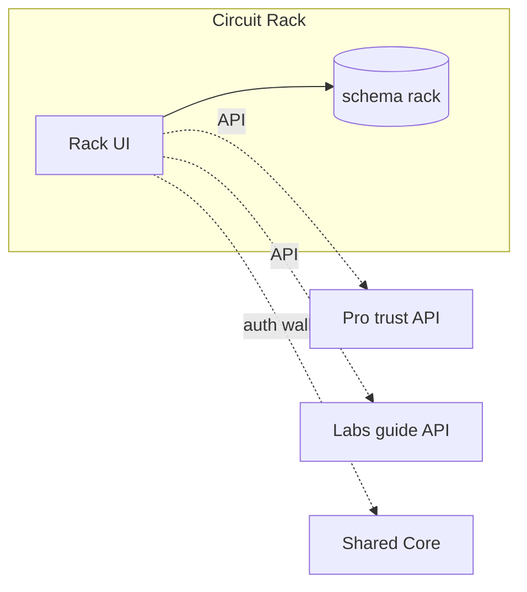

# Circuit Rack · سيركيت راك

**Platform MOC · خريطة المنصة**

| | EN | AR |
|---|----|-----|
| **Tier** | Primary commerce / revenue engine | تجارة أساسية / محرك إيرادات |
| **Vault** | `02_PLATFORMS/rack/` | مجلد راك |
| **Runtime** | `rack.*` · schema `rack` · blue theme | نطاق راك · مخطط معزول · ثيم أزرق |
| **SSOT owns** | Products · catalog · orders · marketplace | منتجات · كتالوج · طلبات · سوق |

**EN:** Sovereign commerce island — regulated industrial marketplace, not generic classifieds.  
**AR:** جزيرة تجارة سيادية — سوق صناعي منضبط، وليس إعلانات عشوائية.

---

## Navigate this island | تنقل داخل الجزيرة

| Doc | EN | AR |
|-----|----|-----|
| **This MOC** | Start here | ابدأ هنا |
| [[02_PLATFORMS/rack/OVERVIEW]] | Short overview | نظرة مختصرة |
| [[02_PLATFORMS/rack/FEATURES_MODULES]] | R-C* · R-G* · R-P* | وحدات الميزات |
| [[02_PLATFORMS/rack/ISOLATION]] | Full isolation checklist | قائمة العزل |

**Ecosystem:** [[02_PLATFORMS/PLATFORMS_INDEX]] · [[00_ROOT_DASHBOARD/HOME]] · [[INDEX]]

---

## PROJECT_BIBLE | الدستور (quick links)

| Topic | Link |
|-------|------|
| Rack section | [[01_CONSTITUTION/PROJECT_BIBLE#Circuit Rack \| سيركيت راك]] |
| Vision & mission | [[01_CONSTITUTION/PROJECT_BIBLE#Vision & Mission \| الرؤية والمهمة]] |
| Features | [[01_CONSTITUTION/PROJECT_BIBLE#Features \| الميزات]] |
| Isolation | [[01_CONSTITUTION/PROJECT_BIBLE#Isolation \| العزل]] |
| Integration law | [[01_CONSTITUTION/PROJECT_BIBLE#Platform Relationships & Backend Integration Rules \| العلاقات وقواعد التكامل الخلفي]] |

---

## Vision & Mission | الرؤية والمهمة

<!-- VISION MISSION SECTION — canonical; do not duplicate below -->

**EN:** **Vision** — Industrial commerce that is trustworthy, searchable, and operationally serious. Rack is the primary revenue engine: a regulated marketplace, not generic classifieds. **Mission** — Own the product and commerce SSOT (catalog, listings, orders, marketplace mechanics). Connect supply and demand through buy · sell · guide. Operate Boost, Bidding, Secondary Market, and Hidden Offers under Rack UX and legal terms. Use shared identity and wallet backend only — never embed Pro or Labs consumer UI. **Audience** — Manufacturers, suppliers, B2B buyers, and procurement teams; Arabic-first with EN/ZH expansion.

**AR:** **الرؤية** — تجارة صناعية موثوقة، قابلة للبحث، وذات جدية تشغيلية؛ راك هو محرك الإيرادات الأساسي عبر سوق منضبط وليس إعلانات عشوائية. **المهمة** — امتلاك مصدر الحقيقة للمنتجات والتجارة (الكتالوج، القوائم، الطلبات، آليات السوق)، وربط العرض بالطلب عبر الشراء والبيع والدليل، وتشغيل Boost والمزايدة والسوق الثانوي والعروض المخفية ضمن شروط راك القانونية، مع استهلاك الهوية والمحفظة من النواة المشتركة خلفياً فقط دون تضمين واجهات المنصات الأخرى. **الجمهور** — المصنّعون والموردون وفرق المشتريات B2B؛ عربي أولاً مع توسع إنجليزي وصيني.

---

<!-- AGREEMENTS SECTION -->

## Key Agreements & User Approvals | الاتفاقات والموافقات الأساسية

**EN:** All legal artifacts are **Rack-scoped** — never bundled with Pro or Labs public terms. Users must explicitly accept before the gated action fires. Parent (BENBENHUB) policy stays internal.

**AR:** كل الوثائق القانونية **ضمن نطاق راك** — لا تُدمج مع شروط Pro أو Labs العلنية. يجب موافقة صريحة قبل تنفيذ الإجراء. سياسة الأب (BENBENHUB) داخلية فقط.

| Agreement | EN — when required | AR — متى تُطلب | Record |
|-----------|-------------------|----------------|--------|
| **Account & privacy** | First Rack login / registration | أول دخول أو تسجيل راك | `rack.consent.account` |
| **Seller & listing** | Before first publish or catalog import | قبل أول نشر أو استيراد كتالوج | `rack.consent.seller_listing` |
| **Buyer & purchase** | Checkout, bid, or offer acceptance | الدفع أو المزايدة أو قبول عرض | `rack.consent.buyer_purchase` |
| **Boost / promotion** | Enabling paid visibility (R-G*) | تفعيل ظهور مدفوع | `rack.consent.boost` |
| **Bidding & secondary market** | Joining auction or secondary listing | دخول مزاد أو قائمة ثانوية | `rack.consent.marketplace_rules` |
| **Hidden offers** | Accessing confidential offer flows | الوصول لتدفقات العروض المخفية | `rack.consent.hidden_offers` |
| **Wholesale / ERP (gated)** | Assigning `wholesale_buyer` or ERP hook | تعيين مشتري جملة أو ربط ERP | `rack.consent.wholesale` + ADR |
| **Wallet settlement** | First wallet debit/credit on Rack | أول حركة محفظة على راك | `rack.consent.wallet` (core ledger, Rack rules) |

**EN — user approvals (UX):** Checkbox + versioned terms link · audit `user_id`, `terms_version`, `locale`, `timestamp` · block action if declined · re-prompt on material version bump (Immutability gate).

**AR — موافقات المستخدم:** خانة اختيار + رابط شروط بنسخة · تدقيق `user_id` و`terms_version` واللغة والوقت · منع الإجراء عند الرفض · إعادة الطلب عند تغيير جوهري للنسخة (بوابة الثبات).

**Forbidden | ممنوع:** One checkbox covering Pro verification or Labs courses · cross-brand “accept all platforms” · storing commerce SSOT in shared core consent tables.

**Constitution:** [[01_CONSTITUTION/PROJECT_BIBLE#Legal & Consents · القانوني والموافقات]] · **Phrases:** `R-legal-*` in [[03_SHARED_CORE/REUSABLE_PHRASES]]

---

<!-- BUSINESS RULES SECTION -->

## Business Rules & Roles | قواعد العمل والأدوار

**EN:** Rack RBAC extends shared identity — roles are enforced in Rack services and UI routes only.

**AR:** صلاحيات راك توسّع الهوية المشتركة — الأدوار تُفرض في خدمات ومسارات راك فقط.

### Roles | الأدوار

| Role | EN responsibility | AR | Scope |
|------|---------------------|-----|-------|
| `buyer` | Browse, purchase, bid (within rules) | تصفح وشراء ومزايدة | Rack consumer |
| `seller` | List, fulfill, manage inventory SSOT | بيع وتنفيذ وإدارة مخزون | Rack catalog/orders |
| `wholesale_buyer` | Volume pricing, gated catalogs (R-P*) | تسعير جملة وكتالوجات مقيدة | Power tier + consent |
| `marketplace_ops` | Boost, disputes, secondary market policy | عمليات السوق والنزاعات | Internal Rack team |
| `compliance_reviewer` | Prohibited listing enforcement | منع المحتوى المحظور | Rack moderation |
| `rack_admin` | Platform config, not cross-platform SSOT | إعداد راك دون SSOT عابر | Rack admin |

### Business rules | قواعد العمل

| # | EN rule | AR | Gate |
|---|---------|-----|------|
| 1 | Product truth (price, stock, specs) lives only in schema `rack` | حقيقة المنتج في `rack` فقط | Scope |
| 2 | Trust badges come from Pro API snapshots — Rack never edits verification | شارات الثقة من Pro عبر API | Truth |
| 3 | Product guides link via `product_id` / `article_id` — no Labs CMS on Rack | أدلة عبر معرّفات API فقط | Scope |
| 4 | Wallet tags `platform_source=rack`; settlement rules owned by Rack | محفظة بوسم راك وقواعد راك | Scope |
| 5 | Listing removal requires audit trail — no silent delete of orders | إزالة قائمة بسجل تدقيق | Immutability |
| 6 | Cross-platform contracts need ADR before production | عقود عابرة تحتاج ADR | Truth + Scope |

---

## Key Features | الميزات الرئيسية

**EN:** Rack features are organized in three tiers. **Core (R-C*)** — catalog SSOT, buy/sell/guide flows, industrial search, seller onboarding, orders in the `rack` schema. **Growth (R-G*)** — Boost, Bidding, Secondary Market, Hidden Offers, seller reviews, Rack notifications. **Power (R-P*)** — wholesale buyer RBAC, Rack-only analytics, bundles, ERP API (gated). Ecosystem modules: M-001 Identity, M-002 Catalog (Rack owner), M-003 Search, M-004 Wallet (`platform_source=rack`), M-005 cross-platform linking by stable IDs.

**AR:** تُنظَّم ميزات راك في ثلاث طبقات. **الأساسي (R-C*)** — كتالوج كمصدر حقيقة، تدفقات شراء/بيع/دليل، بحث صناعي، تسجيل البائع، ودورة الطلبات في مخطط `rack`. **النمو (R-G*)** — Boost، المزايدة، السوق الثانوي، العروض المخفية، تقييمات البائع، وإشعارات راك. **القوة (R-P*)** — صلاحيات مشتري الجملة، تحليلات راك فقط، حزم، وواجهة ERP (مقيدة بالبوابات). وحدات المنظومة: M-001 الهوية، M-002 الكتالوج (مالك راك)، M-003 البحث، M-004 المحفظة (`platform_source=rack`)، M-005 الربط العابر بمعرّفات ثابتة.

| Tier | EN | AR |
|------|----|-----|
| R-C* | Catalog · commerce · search · orders | كتالوج · تجارة · بحث · طلبات |
| R-G* | Boost · bidding · secondary · hidden offers | تعزيز · مزايدة · سوق ثانوي · عروض مخفية |
| R-P* | Wholesale RBAC · analytics · ERP (gated) | جملة · تحليلات · ERP |

**Detail:** [[02_PLATFORMS/rack/FEATURES_MODULES]] · **Phrases:** `R-*` in [[03_SHARED_CORE/REUSABLE_PHRASES]]

---

## Technical Stack | التقنية

**EN:** TypeScript and SQL in a dedicated monorepo slice. Frontend: Next.js App Router at `platforms/rack/app` with blue theme and Rack-only routes. Backend: Node.js for catalog, commerce, and marketplace services. Database: PostgreSQL with isolated Prisma schema `rack` — no joins to `pro` or `labs`. Auth flows through [[03_SHARED_CORE/IDENTITY_SYSTEM]]; payments through [[03_SHARED_CORE/CIRCUIT_WALLET]] with Rack settlement rules. Search index is Rack-owned. Deploy on `rack.*` with independent CI/CD and isolated failure domain. i18n plumbing from core; all product copy owned by Rack.

**AR:** TypeScript وSQL في شريحة مستودع مستقلة. الواجهة: Next.js App Router في `platforms/rack/app` بثيم أزرق ومسارات راك فقط. الخلفية: Node.js لخدمات الكتالوج والتجارة والسوق. قاعدة البيانات: PostgreSQL بمخطط Prisma معزول `rack` دون ربط بـ `pro` أو `labs`. المصادقة عبر [[03_SHARED_CORE/IDENTITY_SYSTEM]]؛ الدفع عبر [[03_SHARED_CORE/CIRCUIT_WALLET]] بقواعد تسوية راك. فهرس البحث مملوك لراك. النشر على `rack.*` بـ CI/CD مستقل ونطاق تعافٍ منفصل. بنية الترجمة من النواة؛ كل نصوص المنتج مملوكة لراك.

**Architecture:** [[03_SHARED_CORE/TECHNICAL_ARCHITECTURE#Circuit Rack Runtime]]

---

## Isolation Rules | قواعد العزل

**EN:** Rack must never become a consumer shell for Pro or Labs. (1) **UI** — No Pro profile chrome or Labs editor on Rack routes. (2) **Data** — No reads or joins into `pro` or `labs` schemas. (3) **Wallet** — Ledger in shared core; commerce rules in Rack; tag `platform_source=rack`. (4) **Deploy** — Independent release and recovery versus siblings. (5) **Legal** — Rack terms and pricing never bundled with other platforms. (6) **SSOT** — Product truth lives only in Rack; peers reference `product_id` via API.

**AR:** يجب ألا يصبح راك قشرة استهلاكية لـ Pro أو Labs. (1) **الواجهة** — ممنوع واجهات ملف Pro أو محرر Labs على مسارات راك. (2) **البيانات** — ممنوع القراءة أو الربط مع مخططات `pro` أو `labs`. (3) **المحفظة** — السجل في النواة المشتركة؛ قواعد التجارة في راك؛ الوسم `platform_source=rack`. (4) **النشر** — إصدار وتعافٍ مستقلان عن المنصات الأخرى. (5) **القانون** — شروط وتسعير راك لا تُدمج مع منصات أخرى. (6) **مصدر الحقيقة** — حقيقة المنتج في راك فقط؛ الأقران يستخدمون `product_id` عبر API.

**Full checklist:** [[02_PLATFORMS/rack/ISOLATION]] · **Law:** [[04_GOVERNANCE/INTEGRATION_RULES]] · **Gates:** [[04_GOVERNANCE/GOVERNANCE_GATES]]

---

## Relationships to Other Platforms | العلاقات

**EN:** Rack relates to peers **by API only**. **Pro** — trust badges and `profile_id` on listings; forbidden: Pro UI embed or Pro SSOT in Rack DB. **Labs** — product guides via `product_id` / `article_id`; forbidden: Labs CMS or checkout on Rack. **Shared core** — auth, wallet, theme, i18n; forbidden: commerce logic in core. **BENBENHUB** — governance gates and ADRs only; forbidden: public umbrella marketing. **Trust flow:** `profile.verified` → Rack badge via API, no iframe. **Knowledge flow:** Rack `product_id` → Labs metadata API → link card on Rack UI only.

**AR:** يرتبط راك بالأقران **عبر API فقط**. **Pro** — شارات ثقة و`profile_id` على القوائم؛ ممنوع: تضمين واجهة Pro أو SSOT Pro في قاعدة راك. **Labs** — أدلة منتج عبر `product_id` / `article_id`؛ ممنوع: CMS Labs أو دفع على راك. **النواة المشتركة** — هوية ومحفظة وثيم وترجمة؛ ممنوع: منطق تجارة في النواة. **BENBENHUB** — بوابات حوكمة وADR فقط؛ ممنوع: تسويق مظلة علنية. **تدفق الثقة:** `profile.verified` → شارة راك عبر API دون iframe. **تدفق المعرفة:** `product_id` في راك → API لابز → بطاقة رابط في واجهة راك فقط.

**Siblings:** [[02_PLATFORMS/pro/README]] · [[02_PLATFORMS/labs/README]]

---

## SSOT & Data Ownership | ملكية الحقيقة

**EN:** Rack owns product catalog, orders, checkout, and marketplace rules. Pro owns profile and verification (Rack reads snapshots). Labs owns articles and courses (Rack links summaries only). Shared core holds user auth ledger when gated.

**AR:** راك يملك كتالوج المنتجات والطلبات والدفع وقواعد السوق. Pro يملك الملف والتحقق (راك يقرأ لقطات). Labs يملك المقالات والدورات (راك يربط ملخصات فقط). النواة المشتركة تحتفظ بسجل المصادقة عند الموافقة.

---

## Before You Ship | قبل الشحن

**EN:** Confirm scope stays in the Rack slice; run governance gates for any cross-platform contract; use `R-*` phrases for copy; update PROJECT_BIBLE if constitutional law changes.

**AR:** تأكد أن النطاق ضمن شريحة راك؛ مرّر بوابات الحوكمة لأي عقد عابر؛ استخدم جمل `R-*` للنصوص؛ حدّث PROJECT_BIBLE إن تغيّر القانون الدستوري.

---

*Maestro · Rack MOC · [[01_CONSTITUTION/PROJECT_BIBLE#Circuit Rack \| سيركيت راك]]*