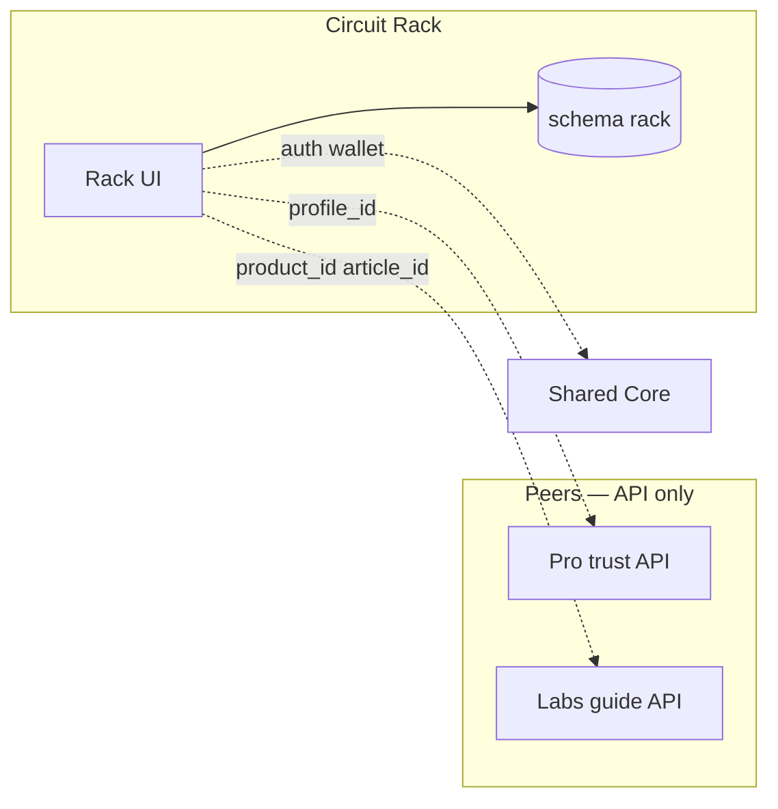

# Circuit Rack · سيركيت راك

**Platform MOC · خريطة المنصة** — Sovereign commerce island · جزيرة التجارة السيادية

| | EN | AR |
|---|----|-----|
| **Tier** | Primary commerce / revenue engine | تجارة أساسية / محرك إيرادات |
| **Vault** | `02_PLATFORMS/rack/` | مجلد راك |
| **Runtime** | `rack.*` · schema `rack` · blue theme | نطاق راك · مخطط معزول · ثيم أزرق |
| **SSOT owns** | Products · catalog · orders · marketplace | منتجات · كتالوج · طلبات · سوق |

**Do not mix with Pro or Labs consumer surfaces.** · **لا تدمج واجهات Pro أو Labs.**

---

## Navigate this island · تنقل داخل الجزيرة

| Doc | EN | AR |
|-----|----|-----|
| **This MOC** | Start here | ابدأ هنا |
| [[02_PLATFORMS/rack/OVERVIEW]] | Short overview | نظرة مختصرة |
| [[02_PLATFORMS/rack/FEATURES_MODULES]] | R-C* · R-G* · R-P* modules | وحدات الميزات |
| [[02_PLATFORMS/rack/ISOLATION]] | Full isolation checklist | قائمة العزل |
| [[02_PLATFORMS/FEATURES_MODULES_DATABASE#Circuit Rack Modules]] | Global registry | السجل العام |

**Ecosystem:** [[02_PLATFORMS/PLATFORMS_INDEX]] · **Home:** [[00_ROOT_DASHBOARD/HOME]] · **Index:** [[INDEX]]

---

## PROJECT_BIBLE · الدستور (quick links)

| Topic | EN | AR | Section |
|-------|----|-----|---------|
| Platforms overview | Three islands index | فهرس الجزر | [[01_CONSTITUTION/PROJECT_BIBLE#Platforms Overview · نظرة عامة على المنصات]] |
| **Rack (canonical)** | Constitution summary | ملخص الدستور | [[01_CONSTITUTION/PROJECT_BIBLE#Circuit Rack · سيركيت راك]] |
| Vision & mission | Full EN/AR in Bible | رؤية ومهمة | [[01_CONSTITUTION/PROJECT_BIBLE#Vision & Mission · الرؤية والمهمة]] |
| Features | R-C / R-G / R-P tiers | الميزات | [[01_CONSTITUTION/PROJECT_BIBLE#Features · الميزات]] |
| Stack | Runtime table | التقنية | [[01_CONSTITUTION/PROJECT_BIBLE#Stack · التقنية]] |
| Isolation | Six rules | العزل | [[01_CONSTITUTION/PROJECT_BIBLE#Isolation · العزل]] |
| Relations | Peer matrix | العلاقات | [[01_CONSTITUTION/PROJECT_BIBLE#Relations · العلاقات]] |
| Integration law | Backend-only contracts | قانون التكامل | [[01_CONSTITUTION/PROJECT_BIBLE#Platform Relationships & Backend Integration Rules · العلاقات وقواعد التكامل الخلفي]] |
| Feature modules | Rack module list in Bible | وحدات راك | [[01_CONSTITUTION/PROJECT_BIBLE#Circuit Rack — Feature Modules]] |
| Gates | Truth · Immutability · Scope | البوابات | [[01_CONSTITUTION/PROJECT_BIBLE#Governance Gates · بوابات الحوكمة]] |

---

## Vision & Mission · الرؤية والمهمة

### English

**Vision** — Industrial commerce that is trustworthy, searchable, and operationally serious. Rack is the **primary revenue engine**: a regulated marketplace, not generic classifieds.

**Mission** — Own the **product and commerce SSOT** (catalog, listings, orders, marketplace mechanics). Connect supply and demand through **buy · sell · guide**. Operate **Boost**, **Bidding**, **Secondary Market**, and **Hidden Offers** under Rack UX and legal terms. Consume shared identity and wallet **backend only** — never sibling UI.

**Audience** — Manufacturers, suppliers, B2B buyers, procurement; Arabic-first (EN/ZH expansion).

### العربية

**الرؤية** — تجارة صناعية موثوقة، قابلة للبحث، وذات جدية تشغيلية. راك محرك الإيرادات الأساسي: **سوق منضبط** وليس إعلانات عشوائية.

**المهمة** — امتلاك **SSOT** للمنتجات والتجارة (الكتالوج، القوائم، الطلبات، آليات السوق). ربط العرض والطلب عبر **شراء · بيع · دليل**. تشغيل **Boost** والمزايدة والسوق الثانوي والعروض المخفية ضمن شروط راك. الهوية والمحفظة من النواة **خلفياً فقط**.

**الجمهور** — المصنّعون والموردون؛ مشتري B2B والمشتريات؛ عربي أولاً.

---

## Key Features · الميزات الرئيسية

### Commerce core · نواة التجارة (R-C*)

| Feature | EN | AR |
|---------|----|-----|
| Catalog SSOT | Products, variants, industrial taxonomy | كتالوج · تصنيف صناعي |
| Buy · Sell · Guide | Regulated listing and transaction flows | شراء · بيع · دليل |
| Search | Product & marketplace index (Rack-owned) | بحث صناعي |
| Seller onboarding | KYC hooks, listing consents | تسجيل البائع |
| Orders | Order lifecycle in `rack` schema | دورة الطلبات |

### Marketplace growth · نمو السوق (R-G*)

| Feature | EN | AR |
|---------|----|-----|
| **Boost** | Paid visibility for listings | تعزيز ظهور القوائم |
| **Bidding** | Auction / bid mechanics | مزايدة |
| **Secondary Market** | Resale flows | سوق ثانوي |
| **Hidden Offers** | Private offer channels | عروض مخفية |

### Power & ops · قوة وتشغيل (R-P*)

| Feature | EN | AR |
|---------|----|-----|
| Wholesale RBAC | Buyer tiers (gated) | صلاحيات مشتري جملة |
| Analytics | Rack-scoped metrics | تحليلات راك |
| Notifications | Commerce events | إشعارات تجارة |
| Wallet | `platform_source=rack` settlements | محفظة بوسم راك |

**Detail:** [[02_PLATFORMS/rack/FEATURES_MODULES]] · **Registry:** [[02_PLATFORMS/FEATURES_MODULES_DATABASE#Circuit Rack Modules]]

**Phrases:** `R-*` in [[03_SHARED_CORE/REUSABLE_PHRASES]] · **Ecosystem modules:** M-001 Identity · M-002 Catalog (Rack owner) · M-003 Search · M-004 Wallet · M-005 linking

---

## Technical Stack · التقنية

### English

| Layer | Stack | Notes |
|-------|--------|-------|
| **Languages** | TypeScript, SQL | Platform slice in monorepo |
| **Frontend** | Next.js App Router · `platforms/rack/app` | Blue theme · Rack-only routes |
| **Backend** | Node.js | Catalog, commerce, marketplace services |
| **Database** | PostgreSQL · Prisma schema `rack` | **No** `pro` / `labs` joins |
| **Auth** | Rack UX → [[03_SHARED_CORE/IDENTITY_SYSTEM]] | JWT · platform roles |
| **Payments** | [[03_SHARED_CORE/CIRCUIT_WALLET]] + Rack rules | Ledger in core; policy in Rack |
| **Search** | Rack-owned product/marketplace index | Not Pro/Labs corpus |
| **Deploy** | `rack.*` · CDN · **independent CI** | Failure domain isolated |
| **i18n** | AR/EN/ZH plumbing from core; **copy owned by Rack** | [[03_SHARED_CORE/THEME_AND_I18N]] |

### العربية

| الطبقة | المكدس | ملاحظات |
|--------|--------|---------|
| **الواجهة** | Next.js · ثيم أزرق | مسارات راك فقط |
| **الخلفية** | Node.js | كتالوج وتجارة |
| **البيانات** | PostgreSQL · `rack` | بدون ربط مخططات الأخوة |
| **الهوية/الدفع** | نواة مشتركة (خلفي) | قواعد التسوية في راك |
| **النشر** | `rack.*` · CI مستقل | عزل التعافي |

**Architecture detail:** [[03_SHARED_CORE/TECHNICAL_ARCHITECTURE#Circuit Rack Runtime]] · **Bible:** [[01_CONSTITUTION/PROJECT_BIBLE#Stack · التقنية]]

---

## Isolation Rules · قواعد العزل

> Rack **never** becomes a shell for Pro or Labs. · راك **ليس** قشرة لـ Pro أو Labs.

| # | EN | AR |
|---|----|-----|
| 1 | **UI** — No Pro profile chrome or Labs editor on Rack routes | **واجهة** — لا Pro ولا محرر Labs على راك |
| 2 | **Data** — No reads/joins into `pro` or `labs` schemas | **بيانات** — لا قراءة مخططات الأخوة |
| 3 | **Wallet** — Ledger in core; commerce rules in Rack; `platform_source=rack` | **محفظة** — قواعد التجارة في راك |
| 4 | **Deploy** — Independent release & recovery vs siblings | **نشر** — مستقل عن Pro/Labs |
| 5 | **Legal** — Rack terms/pricing never bundled with siblings | **قانون** — شروط راك فقط |
| 6 | **SSOT** — Product truth **only** in Rack; peers use `product_id` API | **SSOT** — المنتج في راك فقط |

**Full checklist:** [[02_PLATFORMS/rack/ISOLATION]] · **Law:** [[04_GOVERNANCE/INTEGRATION_RULES]] · **Before cross-platform work:** [[04_GOVERNANCE/GOVERNANCE_GATES]]

---

## Relationships to Other Platforms · العلاقات

### Peer matrix · مصفوفة الأقران

| Peer | Mode | Allowed | Forbidden |
|------|------|---------|-----------|
| **Pro** | API | Trust via `profile_id`; listing badges | Pro UI, Pro SSOT in Rack DB |
| **Labs** | API | Guides via `product_id` / `article_id` | Labs CMS, checkout on Rack |
| **Shared core** | SDK/API | Auth, wallet, theme base, i18n | Commerce logic in core |
| **BENBENHUB** | Governance | Gates, ADRs, survivability vision | Public umbrella consumer brand |

### Integration flows · تدفقات التكامل

| Flow | EN | AR |
|------|----|-----|
| **Trust** | `profile.verified` event → Rack badge via API (no iframe) | تحقق Pro → شارة راك عبر API |
| **Knowledge** | Rack `product_id` → Labs metadata API → **link card on Rack UI only** | منتج راك → API لابز → بطاقة في راك |
| **Wallet** | Spend/earn tagged `rack`; settlement rules in Rack | محفظة بوسم راك |

**Siblings (stay in their islands):** [[02_PLATFORMS/pro/README]] · [[02_PLATFORMS/labs/README]]

---

## SSOT & data ownership · ملكية الحقيقة

| Domain | Owner | Others may |
|--------|-------|------------|
| Product catalog | **Rack** | Read via API + stable `product_id` |
| Orders & checkout | **Rack** | — |
| Marketplace rules | **Rack** | — |
| Profile / verification | Pro | Rack consumes snapshots |
| Articles / courses | Labs | Rack links summaries only |
| User auth ledger | Shared core (gated) | All platforms |

---

## Before you ship · قبل الشحن

| Check | EN | AR |
|-------|----|-----|
| Scope | Change stays in Rack slice / schema | ضمن شريحة راك |
| Gates | Cross-platform? [[04_GOVERNANCE/GOVERNANCE_GATES]] | عابر؟ البوابات |
| Copy | UI strings from `R-*` phrases | نصوص من بنك الجمل |
| Bible | Constitution section updated if law changed | تحديث الدستور إن تغيّر القانون |

---

*Maestro · Rack MOC · [[01_CONSTITUTION/PROJECT_BIBLE#Circuit Rack · سيركيت راك]] · [[02_PLATFORMS/PLATFORMS_INDEX]]*